# Project Requirements Document (PRD)
# AWS Certified Cloud Practitioner Exam Preparation Application

**Document Version:** 1.0  
**Last Updated:** October 21, 2025  
**Project Code:** AWS-CCP-PREP  
**Document Owner:** Edward Mabuyo  

---

## 1. Executive Summary

### 1.1 Overview
The AWS Certified Cloud Practitioner Exam Preparation Application is a comprehensive web-based learning platform designed to provide realistic exam simulation and structured preparation for the AWS Certified Cloud Practitioner certification. This application addresses the critical need for accessible, high-quality, and cost-effective exam preparation tools that mirror the actual AWS certification exam experience.

### 1.2 Strategic Alignment
This project aligns with the following strategic objectives:
- **Personal Development**: Support professional certification and career advancement in cloud computing
- **Accessibility**: Provide a free, self-hosted solution that removes financial barriers to exam preparation
- **Quality Education**: Deliver verified, accurate content sourced from official AWS documentation and reputable training providers
- **Modern Technology Demonstration**: Showcase expertise in React, TypeScript, and modern web development practices

### 1.3 Business Value
**Primary Benefits:**
- **Cost Reduction**: Eliminates $50-200 spent on third-party practice exam platforms
- **Flexible Learning**: Self-paced study with multiple exam modes (full exam, quick practice, study mode)
- **Performance Tracking**: Detailed analytics to identify knowledge gaps and track improvement
- **Reusability**: Foundation for expanding to other AWS certifications (Solutions Architect, Developer, etc.)

**Expected Outcomes:**
- Successfully pass AWS Certified Cloud Practitioner exam on first attempt
- Reduce study time by 30% through targeted practice of weak areas
- Build a portfolio-worthy application demonstrating full-stack development skills
- Create reusable platform for future certification preparation

### 1.4 Key Success Metrics
- **Content Quality**: 500+ verified questions with 95%+ accuracy rate
- **User Experience**: Exam interface similarity score of 90%+ to actual AWS exam
- **Performance**: Application load time under 2 seconds, question navigation under 100ms
- **Effectiveness**: User passes actual AWS exam within 3 attempts of scoring 70%+ on practice exams

---

## 2. Project Goals

### 2.1 SMART Goals

#### Goal 1: Comprehensive Question Bank
**Specific**: Create and verify a database of 500+ AWS Cloud Practitioner exam questions  
**Measurable**: Minimum 500 questions distributed across 4 domains per official exam blueprint  
**Achievable**: Questions sourced from AWS documentation, reputable prep platforms, and validated community resources  
**Relevant**: Directly supports exam preparation with realistic, exam-style questions  
**Time-bound**: Complete within 2 weeks of project start  

**Success Metrics:**
- Cloud Concepts: 130 questions (26%)
- Security & Compliance: 125 questions (25%)
- Technology: 165 questions (33%)
- Billing & Pricing: 80 questions (16%)
- Each question includes verified source URL
- 100% of answers cross-referenced with official AWS documentation

#### Goal 2: Authentic Exam Simulation
**Specific**: Replicate AWS certification exam interface with 95% visual and functional similarity  
**Measurable**: Full exam mode with 65 questions, 90-minute timer, identical navigation patterns  
**Achievable**: Using React and Tailwind CSS to match AWS exam UI/UX  
**Relevant**: Reduces exam-day anxiety through familiarity with interface  
**Time-bound**: Complete core exam interface by end of Week 2  

**Success Metrics:**
- Timer functionality with color-coded warnings
- Question counter and progress indicator
- Mark for review capability
- Review all questions summary screen
- One question per screen presentation
- Previous/Next navigation
- Submit exam with confirmation dialog

#### Goal 3: Progress Tracking and Analytics
**Specific**: Implement comprehensive exam history tracking with performance analytics  
**Measurable**: Store all exam attempts locally with detailed score breakdowns  
**Achievable**: Using browser localStorage with JSON data structure  
**Relevant**: Enables users to identify weak areas and track improvement over time  
**Time-bound**: Complete by end of Week 3  

**Success Metrics:**
- Automatic storage of all exam attempts
- Score breakdown by domain
- Historical trend visualization
- Comparison between attempts
- Export/import functionality for backup
- Detailed question-level review of past exams

#### Goal 4: Enhanced Study Features
**Specific**: Provide flexible study modes beyond full exam simulation  
**Measurable**: Study mode with answer reveals, quick practice mode, domain filtering  
**Achievable**: Conditional rendering based on selected exam mode  
**Relevant**: Supports different learning styles and study phases  
**Time-bound**: Complete by end of Week 3  

**Success Metrics:**
- Untimed study mode with immediate feedback
- Custom quiz length options (10, 20, 30, 50 questions)
- Filter questions by domain/topic
- Show answer feature with detailed explanations
- Bookmark difficult questions
- Add personal notes to questions

### 2.2 Business and User Value Proposition

**For the Primary User (Exam Candidate):**
- **Confidence Building**: Practice in realistic exam environment
- **Cost Savings**: Free alternative to expensive practice exam platforms
- **Targeted Learning**: Identify and focus on weak knowledge areas
- **Flexible Scheduling**: Study anytime without internet dependency (after initial load)
- **Transparency**: Verify question sources and answers independently

**For Portfolio Demonstration:**
- **Technical Skills**: Demonstrates React, TypeScript, state management, localStorage
- **UI/UX Design**: Shows ability to replicate professional interfaces
- **Problem Solving**: Addresses real-world need with practical solution
- **Data Management**: Handles complex data structures without backend
- **User-Centric Design**: Multiple modes for different user needs

---

## 3. Project Overview

### 3.1 Background and Context

#### Industry Context
The AWS Certified Cloud Practitioner certification is the foundational certification for AWS, validating basic understanding of AWS Cloud concepts, services, security, architecture, pricing, and support. As of 2025, cloud computing skills are among the most in-demand technical competencies, with AWS holding 32% market share in cloud infrastructure services.

**Certification Statistics:**
- Over 1 million AWS certifications earned globally
- Cloud Practitioner is recommended entry point by AWS
- Exam cost: $100 USD
- Exam duration: 90 minutes
- Exam format: 65 questions (multiple choice and multiple response)
- Passing score: 700/1000 (approximately 70%)

#### Market Analysis
**Existing Solutions:**
- **Commercial Practice Exams**: $15-50 per exam set (Tutorials Dojo, Whizlabs, Udemy)
- **Training Courses**: $50-300 (A Cloud Guru, Linux Academy, Udemy courses)
- **AWS Official Practice Exam**: $20 for 20 questions

**Market Gap:**
Current solutions are either expensive, lack realistic exam simulation, provide insufficient questions, or don't track long-term progress effectively.

### 3.2 Problem Statement

**Primary Problem:**  
Exam candidates need extensive practice to build confidence and identify knowledge gaps, but existing practice exam platforms are costly, offer limited attempts, and don't provide comprehensive analytics for tracking improvement over time.

**Secondary Problems:**
1. **Insufficient Practice Quantity**: Most platforms offer 100-300 questions; serious candidates need 500+ for thorough preparation
2. **Interface Familiarity**: Practice on different interfaces creates exam-day anxiety
3. **Progress Visibility**: Limited historical tracking makes it difficult to measure improvement
4. **Source Verification**: Questions may be outdated or incorrect with no way to verify sources
5. **Cost Barriers**: Repeated practice attempts become expensive ($15-50 per attempt)

**Impact of Current State:**
- Higher exam failure rates due to insufficient preparation
- Multiple exam attempts required (additional $100 per attempt)
- Increased study time searching for free/affordable resources
- Anxiety on exam day due to interface unfamiliarity

### 3.3 Target Users and Stakeholders

#### Primary User: AWS Exam Candidate
**Demographics:**
- Age: 22-45 years old
- Professional background: IT professionals, developers, students, career changers
- Technical proficiency: Beginner to intermediate with cloud computing
- Location: Global, primarily English-speaking markets

**User Characteristics:**
- **Goal-oriented**: Focused on passing certification exam
- **Budget-conscious**: Seeking cost-effective study resources
- **Self-motivated**: Prefer self-paced learning over structured classes
- **Detail-oriented**: Want to understand not just answers but explanations
- **Progress-focused**: Need to see measurable improvement

**User Personas:**

**Persona 1: "Career Changer Carlos"**
- 28 years old, transitioning from help desk to cloud engineer
- Limited cloud experience, studying evenings and weekends
- Budget: Minimal, already paid for exam once and failed
- Needs: Extensive practice, detailed explanations, confidence building
- Pain points: Information overload, unclear on where gaps are

**Persona 2: "Advancing Anna"**
- 35 years old, software developer wanting to add cloud skills
- Some AWS experience through work projects
- Budget: Moderate, but prefers free resources
- Needs: Targeted practice on weak areas, efficient study path
- Pain points: Limited study time, needs focused practice not general review

**Persona 3: "Student Sam"**
- 22 years old, recent computer science graduate
- Academic cloud knowledge but no practical experience
- Budget: Very limited, student loans
- Needs: Practical scenario questions, real-world context
- Pain points: Theoretical knowledge doesn't translate to exam questions

#### Secondary Stakeholder: Future Users
The application is designed for personal use but has potential to benefit:
- Other certification candidates (if shared as open-source)
- Educators creating custom quiz applications
- Developers seeking portfolio examples

### 3.4 Key Constraints and Assumptions

#### Technical Constraints
1. **No Backend Infrastructure**: Application must function entirely client-side
   - Rationale: Minimize hosting costs and complexity
   - Implication: All data stored in browser localStorage
   - Limitation: Data not synchronized across devices

2. **Browser Storage Limits**: localStorage typically limited to 5-10MB
   - Implication: Question database must be optimized for size
   - Mitigation: Use efficient JSON structure, consider compression

3. **Browser Compatibility**: Must support modern browsers (Chrome, Firefox, Safari, Edge)
   - Minimum versions: Last 2 major versions of each browser
   - No Internet Explorer support

4. **Single User**: Application designed for individual use, not multi-user scenarios
   - No user authentication or profile management
   - No social features or leaderboards

#### Resource Constraints
1. **Development Time**: Target 3-4 weeks for MVP
   - Solo developer project
   - Part-time development (evenings/weekends)
   
2. **Budget**: Zero budget project
   - Free hosting (Vercel, Netlify, or GitHub Pages)
   - Free tools and libraries only
   - No paid APIs or services

3. **Content Creation**: Question collection is most time-intensive phase
   - Estimated 30-40 hours for 500 questions
   - Requires manual verification against AWS docs

#### Assumptions
1. **User Environment**:
   - Users have stable internet connection for initial load
   - Users access from desktop or tablet (not mobile-optimized)
   - Users have modern browser with JavaScript enabled
   - Users comfortable with English language content

2. **Content Availability**:
   - Sufficient publicly available questions exist for collection
   - AWS documentation provides verification for all questions
   - Sources will remain accessible throughout project

3. **User Behavior**:
   - Users will take multiple practice exams
   - Users will review incorrect answers
   - Users understand this is supplementary to other study materials
   - Users will export their history for backup

4. **Legal and Ethical**:
   - Collected questions don't violate copyright
   - Questions are transformed/paraphrased appropriately
   - Application includes disclaimers about unofficial status
   - Source attribution satisfies fair use requirements

---

## 4. Core Functionalities

### 4.1 Question Bank Management System

#### 4.1.1 Question Database Structure
The question bank is the foundational component of the application, storing all exam questions in a structured JSON format.

**Functional Requirements:**
- Store minimum 500 questions across 4 AWS exam domains
- Support both single-answer and multiple-answer question types
- Include detailed explanations for each correct answer
- Maintain source attribution for verification
- Enable easy updates and maintenance

**Data Structure:**
```json
{
  "version": "1.0",
  "lastUpdated": "2025-10-21",
  "totalQuestions": 500,
  "questions": [
    {
      "id": "q001",
      "questionText": "Which AWS service provides a fully managed NoSQL database?",
      "options": [
        "Amazon RDS",
        "Amazon DynamoDB",
        "Amazon Redshift",
        "Amazon Aurora"
      ],
      "correctAnswers": [1],
      "multipleAnswers": false,
      "explanation": "Amazon DynamoDB is a fully managed NoSQL database service that provides fast and predictable performance with seamless scalability. RDS and Aurora are relational databases, while Redshift is a data warehousing solution.",
      "domain": "technology",
      "topic": "Databases",
      "difficulty": "easy",
      "sourceUrl": "https://aws.amazon.com/dynamodb/",
      "sourceName": "AWS Official Documentation",
      "tags": ["dynamodb", "nosql", "databases"]
    }
  ]
}
```

**Domain Distribution:**
- **cloud-concepts**: 130 questions (26%)
  - Topics: AWS Cloud value proposition, cloud economics, cloud architecture design principles
- **security**: 125 questions (25%)
  - Topics: Shared responsibility model, security and compliance, access management, security support
- **technology**: 165 questions (33%)
  - Topics: AWS services, deployment and operations, AWS global infrastructure
- **billing**: 80 questions (16%)
  - Topics: Pricing models, billing and support, cost management

#### 4.1.2 Question Validation Rules
**Quality Standards:**
- Question text: 50-300 characters, clear and unambiguous
- Options: 4-5 choices, all plausible distractors
- Explanation: 100-500 characters, references AWS documentation
- Source URL: Must be valid and accessible
- No duplicate questions (checked by similarity)

**Content Verification Process:**
1. Initial question collection from reputable sources
2. Cross-reference answer with AWS official documentation
3. Verify question aligns with current exam blueprint
4. Check for outdated information (services, pricing, features)
5. Validate explanation accuracy
6. Test question clarity with practice attempts

### 4.2 Exam Simulation Engine

#### 4.2.1 Exam Mode: Full Practice Exam

**Purpose**: Replicate the complete AWS Certified Cloud Practitioner exam experience

**Specifications:**
- **Question Count**: 65 questions (matching official exam)
- **Time Limit**: 90 minutes (5,400 seconds)
- **Question Selection**: Randomized from full question bank
- **Domain Weighting**: Proportional to official exam blueprint
  - Cloud Concepts: 17 questions (26%)
  - Security: 16 questions (25%)
  - Technology: 21 questions (33%)
  - Billing: 11 questions (16%)
- **Question Order**: Completely randomized each attempt
- **No Duplicates**: Same question cannot appear twice in single exam

**User Flow:**
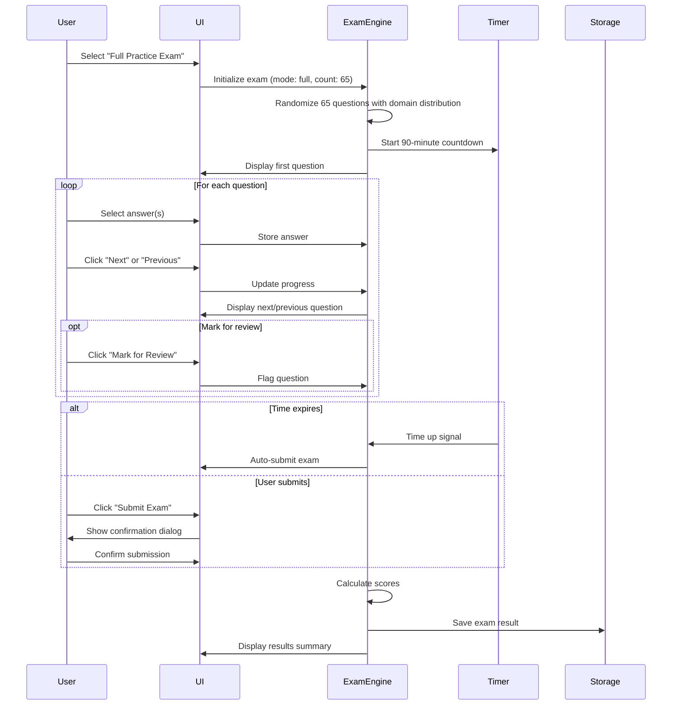

**Features:**
- One question displayed per screen
- Cannot skip questions (must select answer or leave blank)
- Can navigate forward and backward freely
- "Mark for Review" flag available for each question
- Timer visible at all times (top-right corner)
- Progress indicator shows answered/unanswered/marked questions
- "Review All" button to see summary grid
- Submission requires confirmation dialog

**Validation Rules:**
- At least 50% of questions must be answered to submit
- Warning if unanswered questions exist before submission
- Cannot return to exam after submission

#### 4.2.2 Exam Mode: Quick Practice

**Purpose**: Shorter practice sessions for focused study or time-constrained users

**Specifications:**
- **Question Count Options**: 10, 20, 30, or 50 questions
- **Time Allocation**: Proportional to full exam
  - 10 questions: 14 minutes (83 seconds per question)
  - 20 questions: 28 minutes
  - 30 questions: 42 minutes
  - 50 questions: 69 minutes
- **Question Selection**: Randomized from full bank
- **Domain Weighting**: Proportional distribution maintained

**Configuration Options:**
- User selects question count
- Optional: User selects specific domain to focus on
- Optional: User selects difficulty level

**Features:**
- All Full Exam features included
- Faster scoring and review
- Ideal for daily practice sessions

#### 4.2.3 Exam Mode: Study Mode

**Purpose**: Flexible learning environment with immediate feedback

**Specifications:**
- **Time Limit**: None (untimed)
- **Question Count**: User-defined or filtered set
- **Immediate Feedback**: Available on demand
- **Flexible Navigation**: Can jump to any question
- **Answer Reveal**: Show correct answer and explanation without completing exam

**Unique Features:**
- "Show Answer" button on each question
- Correct answer highlighted in green
- User's incorrect selection marked in red
- Detailed explanation displayed
- Related AWS documentation links provided
- Source URL prominently displayed
- No scoring or pass/fail designation

**Filtering Options:**
- Filter by domain (cloud-concepts, security, technology, billing)
- Filter by topic (specific AWS services or concepts)
- Filter by difficulty (easy, medium, hard)
- Filter by previous attempts (only questions answered incorrectly)
- Filter by bookmarked questions

**Study Flow:**
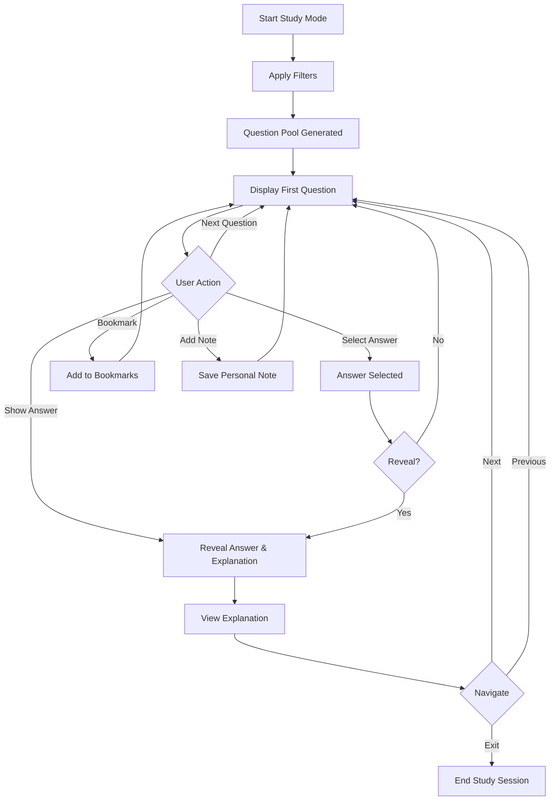

### 4.3 Timer System

#### 4.3.1 Countdown Timer Component

**Functional Requirements:**
- Display time remaining in HH:MM:SS format
- Update every second
- Persist across page refreshes (if browser doesn't close)
- Trigger warnings at specific thresholds
- Auto-submit exam when timer reaches 00:00:00

**Visual States:**
- **Normal** (> 15 minutes): White/light gray background, dark text
- **Warning** (5-15 minutes): Yellow/orange background (#F39C12)
- **Critical** (< 5 minutes): Red background (#E74C3C), bold text
- **Expired** (0:00:00): Red background, flashing effect

**Timer Behavior by Mode:**
- **Full Exam**: 90 minutes, cannot pause, auto-submits at expiry
- **Quick Practice**: Variable time based on question count, cannot pause
- **Study Mode**: No timer (optional timer for self-discipline)

**Technical Implementation:**
```typescript
interface TimerState {
  startTime: number;      // Unix timestamp when timer started
  duration: number;       // Total duration in seconds
  remainingTime: number;  // Seconds remaining
  isRunning: boolean;     // Timer active state
  isPaused: boolean;      // Pause state (only for non-exam modes)
  warnings: {
    fifteenMinute: boolean;
    fiveMinute: boolean;
  };
}
```

**Events:**
- `onTimerStart`: Timer begins countdown
- `onTimerTick`: Every second update
- `onWarningThreshold`: 15 minutes and 5 minutes remaining
- `onTimerExpire`: Time reaches zero
- `onTimerPause`: User pauses timer (study mode only)
- `onTimerResume`: User resumes timer

#### 4.3.2 Time Tracking and Analytics

**Data Collected:**
- Total exam duration (actual time spent)
- Time per question (start to selection/navigation)
- Time spent on marked questions
- Average time per domain
- Time remaining at submission

**Analytics Usage:**
- Identify questions that take excessive time (potential knowledge gaps)
- Compare time usage across attempts
- Optimize time management strategies
- Display in exam history

### 4.4 Question Navigation and Interaction

#### 4.4.1 Question Display Component

**Layout Structure:**
```
┌─────────────────────────────────────────────────────────────┐
│  AWS Cloud Practitioner Practice Exam     Timer: 01:23:45   │
├─────────────────────────────────────────────────────────────┤
│  Question 15 of 65                                    ⚑ Mark │
├─────────────────────────────────────────────────────────────┤
│                                                               │
│  Which AWS service would you use to create a private         │
│  network in the AWS Cloud?                                   │
│                                                               │
│  [ ] Amazon VPC                                              │
│  [ ] AWS Direct Connect                                      │
│  [ ] Amazon CloudFront                                       │
│  [ ] AWS VPN                                                 │
│                                                               │
│  ℹ Source: AWS Documentation (click to view)                │
│                                                               │
├─────────────────────────────────────────────────────────────┤
│  [◄ Previous]              [Review All]          [Next ►]    │
└─────────────────────────────────────────────────────────────┘
```

**Question Text Rendering:**
- Support for basic formatting (bold, italics, code snippets)
- Line breaks preserved
- Maximum width: 800px for readability
- Font size: 16-18px
- Line height: 1.6 for comfortable reading

**Answer Options:**
- **Single Answer Questions**: Radio buttons
  - Only one option can be selected
  - Clicking different option deselects previous
- **Multiple Answer Questions**: Checkboxes
  - Header text indicates: "Select ALL that apply"
  - Multiple selections allowed
  - Visual indicator shows how many answers expected
- Option text: 14-16px font size
- Hover effect: Light background highlight
- Selected state: Blue background, white text
- Adequate spacing: 16px between options

**Interactive Elements:**
- **Mark for Review**: Toggle button/checkbox
  - Visual indicator: Flag icon
  - Yellow background when marked
  - Persists across navigation
- **Source Link**: Collapsible/expandable
  - Initially shown as small link
  - Expands to show full URL and source name
  - Click opens in new tab

#### 4.4.2 Progress Indicator

**Visual Design:**
```
[●●●●●○○●●○○○○○○] 7 of 15 answered | 2 marked for review
```

**Information Displayed:**
- Total questions: e.g., "15 of 65"
- Answered questions: Filled circles (●)
- Unanswered questions: Empty circles (○)
- Current question: Highlighted/larger circle
- Marked for review: Flag icon overlay
- Position: Top of question area, always visible

**Color Coding:**
- Answered: Blue/green
- Unanswered: Gray
- Current: Orange/accent color
- Marked: Yellow flag

#### 4.4.3 Review Summary Screen

**Purpose**: Provide overview of all questions and their status

**Layout:**
```
┌─────────────────────────────────────────────────────────────┐
│                    Question Review                           │
├─────────────────────────────────────────────────────────────┤
│  Status:  [All] [Answered: 45] [Unanswered: 20] [Marked: 8] │
├─────────────────────────────────────────────────────────────┤
│                                                               │
│  [●1]  [●2]  [○3]  [●4]  [●5]  [●6]  [○7]  [●8]  [●9]  [●10] │
│                                                               │
│  [●11] [●12] [⚑13] [○14] [●15] [●16] [⚑17] [●18] [●19] [○20] │
│                                                               │
│  [●21] [●22] [●23] [○24] [●25] [●26] [●27] [⚑28] [○29] [●30] │
│                                                               │
│  ... (continues for all questions)                           │
│                                                               │
│  ● Answered    ○ Unanswered    ⚑ Marked for Review          │
│                                                               │
├─────────────────────────────────────────────────────────────┤
│  [Return to Exam]                    [Submit Exam]           │
└─────────────────────────────────────────────────────────────┘
```

**Features:**
- Click any question number to jump directly to that question
- Filter by status (all, answered, unanswered, marked)
- Visual grid layout (10 questions per row)
- Hover shows question preview (first 50 characters)
- Submit button prominently placed
- Warning if unanswered questions exist

#### 4.4.4 Answer Reveal (Study Mode)

**Activation:**
- "Show Answer" button appears in study mode only
- Available before or after user selects answer
- Click reveals correct answer(s) and explanation

**Visual Feedback:**
```
Question: Which AWS service provides managed DDoS protection?

☑ AWS Shield                    ✓ CORRECT
☐ AWS WAF
☐ Amazon GuardDuty
☐ AWS CloudTrail

Explanation:
AWS Shield is a managed DDoS protection service. AWS Shield Standard 
is automatically included at no extra cost, while Shield Advanced 
provides enhanced protections.

Related Documentation:
• AWS Shield Overview: https://aws.amazon.com/shield/
• DDoS Protection Best Practices: https://...

Source: AWS Official Documentation
URL: https://aws.amazon.com/shield/
```

**Elements:**
- Correct answers: Green checkmark (✓), green background
- Incorrect user selections: Red X (✗), red background
- Unselected correct answers: Orange highlight (if user missed them)
- Detailed explanation: Below options, boxed area
- Related links: Expandable section
- Source citation: At bottom

### 4.5 Scoring and Results System

#### 4.5.1 Score Calculation Engine

**Scoring Algorithm:**
```typescript
interface ScoringResult {
  totalQuestions: number;
  correctAnswers: number;
  incorrectAnswers: number;
  unansweredQuestions: number;
  rawScore: number;              // Correct answers count
  percentageScore: number;        // (correct / total) * 100
  scaledScore: number;            // AWS-style: 100-1000 scale
  passFail: 'pass' | 'fail';     // Based on 700/1000 threshold
  domainScores: DomainScore[];
}

interface DomainScore {
  domain: string;
  questionsInDomain: number;
  correctInDomain: number;
  percentageScore: number;
  scaledScore: number;
}
```

**Calculation Steps:**
1. Count total correct answers
2. Calculate percentage: (correct / total) × 100
3. Scale to AWS format: ((correct / total) × 900) + 100 = score out of 1000
4. Determine pass/fail: ≥ 700 = pass, < 700 = fail
5. Calculate domain-specific scores using same formula
6. Identify strongest and weakest domains

**AWS-Style Scoring:**
- Minimum score: 100 (0% correct)
- Maximum score: 1000 (100% correct)
- Passing score: 700 (approximately 70% correct)
- Matches official AWS certification scoring system

#### 4.5.2 Results Summary Page

**Immediate Results Display:**

```
┌─────────────────────────────────────────────────────────────┐
│                     EXAM RESULTS                             │
├─────────────────────────────────────────────────────────────┤
│                                                               │
│                      PASS                                     │
│                    Score: 775                                 │
│                                                               │
│  ━━━━━━━━━━━━━━━━━━━━━━━━━━━━━━━━━━━━━━━━━━━━━━━━━━━━━━━━  │
│                                                               │
│  Overall Performance:  48 correct out of 65 (73.8%)          │
│  Time Taken: 67 minutes of 90 minutes                        │
│                                                               │
│  Score by Domain:                                             │
│  ┌─────────────────────────────────────────────────────┐    │
│  │ Cloud Concepts          82%  ████████░░              │    │
│  │ Security & Compliance   71%  ███████░░░              │    │
│  │ Technology              69%  ██████░░░░              │    │
│  │ Billing & Pricing       77%  ███████░░░              │    │
│  └─────────────────────────────────────────────────────┘    │
│                                                               │
│  Strongest Area: Cloud Concepts (82%)                        │
│  Needs Improvement: Technology (69%)                         │
│                                                               │
├─────────────────────────────────────────────────────────────┤
│  [Review Answers]  [View History]  [Take New Exam]          │
└─────────────────────────────────────────────────────────────┘
```

**Components:**
1. **Pass/Fail Badge**: Large, prominent display
   - Pass: Green background, white text
   - Fail: Red background, white text

2. **Scaled Score**: AWS-style score (100-1000)
   - Large font size
   - Color-coded: Green for pass, red for fail

3. **Performance Summary**:
   - Correct/total answers
   - Percentage score
   - Time taken vs. available time
   - Completion rate

4. **Domain Breakdown**:
   - Horizontal bar charts
   - Percentage for each domain
   - Color-coded bars (green for strong, red for weak)
   - Domain names clearly labeled

5. **Insights**:
   - Strongest performing domain
   - Weakest performing domain (needs improvement)
   - Comparison to previous attempts (if available)

#### 4.5.3 Detailed Results Review

**Question-by-Question Review:**

```
┌─────────────────────────────────────────────────────────────┐
│                  Detailed Results Review                     │
├─────────────────────────────────────────────────────────────┤
│  Filter: [All] [Correct] [Incorrect] [Marked] [By Domain]   │
├─────────────────────────────────────────────────────────────┤
│                                                               │
│  Question 1 of 65                          Domain: Technology │
│  ✓ CORRECT                                                   │
│                                                               │
│  Which AWS service provides managed DDoS protection?         │
│                                                               │
│  Your Answer:                                                │
│  ☑ AWS Shield                              ✓ CORRECT         │
│                                                               │
│  Other Options:                                              │
│  ☐ AWS WAF                                                   │
│  ☐ Amazon GuardDuty                                          │
│  ☐ AWS CloudTrail                                            │
│                                                               │
│  Explanation: AWS Shield is a managed DDoS protection...     │
│                                                               │
│  [◄ Previous Question]                  [Next Question ►]    │
│                                                               │
├─────────────────────────────────────────────────────────────┤
│                                                               │
│  Question 2 of 65                       Domain: Security     │
│  ✗ INCORRECT                                                 │
│                                                               │
│  Which of the following are best practices for IAM?          │
│  (Select TWO)                                                │
│                                                               │
│  Your Answers:                                               │
│  ☑ Enable MFA for the root account     ✓ CORRECT            │
│  ☑ Share root account credentials       ✗ INCORRECT         │
│                                                               │
│  You Missed:                                                 │
│  ☐ Use IAM roles for applications       ⚠ SHOULD BE CHECKED │
│                                                               │
│  Other Options:                                              │
│  ☐ Disable AWS CloudTrail                                   │
│                                                               │
│  Explanation: IAM best practices include enabling MFA...     │
│                                                               │
│  [◄ Previous Question]                  [Next Question ►]    │
│                                                               │
└─────────────────────────────────────────────────────────────┘
```

**Features:**
- Navigate through all questions sequentially
- Filter to show only incorrect answers
- Filter by domain
- Filter marked questions
- Clear visual indicators (✓ ✗ ⚠)
- Color coding (green, red, orange)
- Full explanation for each question
- Source URL available
- Jump to question navigation

**Filter Options:**
- **All**: Show every question in order
- **Correct**: Only questions answered correctly
- **Incorrect**: Only questions answered incorrectly (most important for learning)
- **Marked**: Only questions marked for review during exam
- **By Domain**: Filter to specific domain

#### 4.5.4 Performance Visualization

**Chart Types:**

1. **Radar Chart** (Domain Performance):
```
        Cloud Concepts
             /|\
            / | \
         82%  |  \
           /  |   \
Billing   ----+---- Security
  77%      \ | /     71%
            \|/
         Technology
            69%
```

2. **Progress Trend Line** (Score History):
```
Score
1000 |                                    
 900 |                                 ●
 800 |                      ●     ●
 700 | - - - - Pass Line - - - - - - - -
 600 |           ●     ●
 500 |      ●
     |_________________________________
      1    2    3    4    5    6    7
                Attempt Number
```

3. **Domain Bar Chart** (Current vs. Average):
```
Cloud          ████████░░ 82% (Avg: 75%)
Security       ███████░░░ 71% (Avg: 72%)
Technology     ██████░░░░ 69% (Avg: 68%)
Billing        ███████░░░ 77% (Avg: 74%)
```

**Insights Generated:**
- Improvement rate between attempts
- Consistency across domains
- Time to reach passing score
- Questions frequently missed
- Topics requiring more study

### 4.6 Exam History and Progress Tracking

#### 4.6.1 Local Storage Architecture

**Storage Strategy:**
The application uses browser's `localStorage` API to persist exam history and user data without requiring a backend server.

**Data Structure:**
```typescript
interface LocalStorageSchema {
  version: string;
  lastUpdated: number;
  examHistory: ExamAttempt[];
  userPreferences: UserPreferences;
  bookmarkedQuestions: string[];
  questionNotes: Record<string, string>;
}

interface ExamAttempt {
  id: string;                    // Unique UUID
  timestamp: number;             // Unix timestamp
  examMode: 'full' | 'quick' | 'study';
  configuration: {
    questionCount: number;
    timeLimit: number;           // in seconds
    domainFilter?: string;
    difficultyFilter?: string;
  };
  questions: QuestionAttempt[];
  score: ScoreBreakdown;
  timeTaken: number;             // in seconds
  completed: boolean;
}

interface QuestionAttempt {
  questionId: string;
  userAnswers: number[];         // indices of selected options
  correctAnswers: number[];
  isCorrect: boolean;
  timeSpent: number;             // seconds spent on this question
  wasMarkedForReview: boolean;
  domain: string;
}

interface ScoreBreakdown {
  totalQuestions: number;
  correctAnswers: number;
  percentageScore: number;
  scaledScore: number;           // 100-1000
  passFail: 'pass' | 'fail';
  domainScores: {
    cloudConcepts: number;
    security: number;
    technology: number;
    billing: number;
  };
}
```

**Storage Operations:**
```typescript
// Save exam result
function saveExamResult(examAttempt: ExamAttempt): void {
  const storage = getLocalStorage();
  storage.examHistory.push(examAttempt);
  storage.lastUpdated = Date.now();
  localStorage.setItem('awsExamPrep', JSON.stringify(storage));
}

// Retrieve exam history
function getExamHistory(): ExamAttempt[] {
  const storage = getLocalStorage();
  return storage.examHistory.sort((a, b) => b.timestamp - a.timestamp);
}

// Export history as JSON file
function exportHistory(): void {
  const storage = getLocalStorage();
  const dataStr = JSON.stringify(storage, null, 2);
  const dataBlob = new Blob([dataStr], { type: 'application/json' });
  const url = URL.createObjectURL(dataBlob);
  const link = document.createElement('a');
  link.href = url;
  link.download = `aws-exam-history-${Date.now()}.json`;
  link.click();
}

// Import history from JSON file
function importHistory(file: File): Promise<void> {
  return new Promise((resolve, reject) => {
    const reader = new FileReader();
    reader.onload = (e) => {
      try {
        const imported = JSON.parse(e.target.result as string);
        // Validate and merge with existing data
        const storage = getLocalStorage();
        storage.examHistory = [...storage.examHistory, ...imported.examHistory];
        localStorage.setItem('awsExamPrep', JSON.stringify(storage));
        resolve();
      } catch (error) {
        reject(error);
      }
    };
    reader.readAsText(file);
  });
}
```

**Storage Limits and Management:**
- localStorage typically limited to 5-10MB per domain
- Implement data rotation: Keep last 100 exam attempts
- Warn user when storage exceeds 4MB
- Provide "Clear Old History" function (keep last 30 days)
- Regular validation to prevent corruption

#### 4.6.2 History Dashboard

**Layout:**
```
┌─────────────────────────────────────────────────────────────┐
│                     Exam History                             │
├─────────────────────────────────────────────────────────────┤
│  Statistics                                                  │
│  ┌──────────────┬──────────────┬──────────────┬───────────┐ │
│  │ Total Exams  │ Average Score│  Best Score  │ Pass Rate │ │
│  │     12       │     723      │     845      │    75%    │ │
│  └──────────────┴──────────────┴──────────────┴───────────┘ │
├─────────────────────────────────────────────────────────────┤
│  Recent Attempts:                                            │
│  ┌─────────────────────────────────────────────────────┐    │
│  │ Oct 21, 2025  Full Exam   Score: 845  ✓ PASS        │    │
│  │ 10:30 AM      65 questions  Time: 78 min            │    │
│  │ [View Details]                                      │    │
│  └─────────────────────────────────────────────────────┘    │
│                                                               │
│  ┌─────────────────────────────────────────────────────┐    │
│  │ Oct 20, 2025  Full Exam   Score: 762  ✓ PASS        │    │
│  │ 2:15 PM       65 questions  Time: 85 min            │    │
│  │ [View Details]                                      │    │
│  └─────────────────────────────────────────────────────┘    │
│                                                               │
│  ┌─────────────────────────────────────────────────────┐    │
│  │ Oct 18, 2025  Full Exam   Score: 685  ✗ FAIL        │    │
│  │ 9:00 AM       65 questions  Time: 89 min            │    │
│  │ [View Details]                                      │    │
│  └─────────────────────────────────────────────────────┘    │
│                                                               │
│  [Export History] [Import History] [Clear Old Data]         │
└─────────────────────────────────────────────────────────────┘
```

**Features:**
- **Summary Statistics**: Aggregated performance metrics
- **Chronological List**: All attempts sorted by date (newest first)
- **Quick Filters**: 
  - All exams
  - Passed only
  - Failed only
  - Full exams only
  - Quick practice only
- **Sort Options**:
  - Date (newest/oldest)
  - Score (highest/lowest)
  - Exam type
- **Search**: Search by date range
- **Visual Indicators**: Pass/fail badges, score colors

#### 4.6.3 Historical Performance Analytics

**Trend Analysis:**
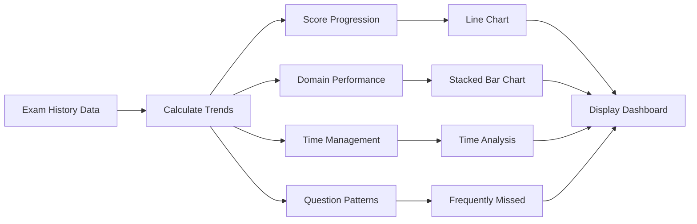

**Analytics Metrics:**

1. **Score Progression Over Time**
   - Line graph showing score trend
   - Highlight passing threshold
   - Show improvement rate
   - Identify plateaus

2. **Domain Performance Comparison**
   - Compare performance across all 4 domains
   - Show average score per domain across all attempts
   - Identify consistently weak areas
   - Track improvement in each domain

3. **Time Management Analysis**
   - Average time per question
   - Time remaining at submission
   - Questions that consistently take longer
   - Improvement in time efficiency

4. **Question Pattern Recognition**
   - Questions frequently answered incorrectly
   - Topics with highest miss rate
   - Specific AWS services requiring more study
   - Correlation between question difficulty and performance

**Insights Generation:**
```typescript
interface PerformanceInsights {
  overallTrend: 'improving' | 'declining' | 'stable';
  improvementRate: number;              // percentage points per attempt
  attemptsToPass: number;               // estimated based on trend
  strongestDomain: string;
  weakestDomain: string;
  recommendedFocus: string[];           // topics to study
  readinessScore: number;               // 0-100 scale
  timeManagement: 'excellent' | 'good' | 'needs improvement';
}
```

#### 4.6.4 Detailed Exam Review (Historical)

**Purpose**: Review any past exam attempt in full detail

**Features:**
- Select any exam from history
- View complete question list with user's answers
- See which questions were correct/incorrect
- Review explanations for all questions
- Compare with other attempts on same questions
- Identify patterns in errors
- Re-study problematic questions

**Navigation:**
```
History Dashboard → Select Exam → Detailed Review
                                    ↓
                        ┌─────────────────────┐
                        │ Overview Tab        │
                        │ Questions Tab       │
                        │ Analytics Tab       │
                        │ Comparison Tab      │
                        └─────────────────────┘
```

**Comparison Feature:**
- Compare current attempt with previous attempts
- Show if performance improved on previously missed questions
- Highlight questions answered differently
- Track consistency in knowledge areas

### 4.7 Additional Features

#### 4.7.1 Question Bookmarking

**Purpose**: Mark difficult questions for later focused study

**Functionality:**
- Click bookmark icon on any question
- Bookmarked questions saved to localStorage
- Create custom study session from bookmarked questions
- Remove bookmark after mastering the question
- View all bookmarked questions in dedicated section

**Bookmark Interface:**
```
┌─────────────────────────────────────────────┐
│  My Bookmarked Questions (23)                │
├─────────────────────────────────────────────┤
│  Filter by Domain: [All] [Cloud] [Security] │
├─────────────────────────────────────────────┤
│  ⭐ Q47: Which AWS service...                │
│     Domain: Technology                       │
│     Times attempted: 3 | Times incorrect: 2  │
│     [Study Now] [Remove]                     │
├─────────────────────────────────────────────┤
│  ⭐ Q128: What is the AWS Shared...          │
│     Domain: Security                         │
│     Times attempted: 2 | Times incorrect: 2  │
│     [Study Now] [Remove]                     │
├─────────────────────────────────────────────┤
│  [Practice All Bookmarks] [Clear All]        │
└─────────────────────────────────────────────┘
```

#### 4.7.2 Personal Notes

**Purpose**: Add custom notes to questions for personal reference

**Functionality:**
- Add note button available on each question
- Notes saved to localStorage with question ID
- Support basic text formatting
- Notes displayed when reviewing question
- Search notes across all questions
- Export notes as separate file

**Note Structure:**
```typescript
interface QuestionNote {
  questionId: string;
  note: string;
  createdAt: number;
  updatedAt: number;
  tags: string[];
}
```

**Note Interface:**
```
┌─────────────────────────────────────────────┐
│  Add Note for Question 47                    │
├─────────────────────────────────────────────┤
│  ┌─────────────────────────────────────────┐ │
│  │ Remember: DynamoDB is NoSQL, not SQL    │ │
│  │ RDS is for relational databases         │ │
│  │ Aurora is MySQL/PostgreSQL compatible   │ │
│  │                                          │ │
│  │ Mnemonic: "Dynamo" sounds like "No"     │ │
│  └─────────────────────────────────────────┘ │
│                                               │
│  Tags: [databases] [dynamodb] [nosql]        │
│                                               │
│  [Save] [Cancel]                             │
└─────────────────────────────────────────────┘
```

#### 4.7.3 Keyboard Shortcuts

**Purpose**: Enhance user experience with keyboard navigation

**Shortcut Mappings:**
- **Navigation:**
  - `Left Arrow` or `P`: Previous question
  - `Right Arrow` or `N`: Next question
  - `Home`: First question
  - `End`: Last question
  - `R`: Review all questions
  
- **Selection:**
  - `1`, `2`, `3`, `4`, `5`: Select option 1-5
  - `Space`: Toggle current option (for multiple answer questions)
  
- **Actions:**
  - `M`: Mark/unmark for review
  - `B`: Bookmark question
  - `S`: Show answer (Study mode only)
  - `Enter`: Submit exam (on Review screen)
  - `Esc`: Close modal/cancel action
  
- **Navigation:**
  - `Tab`: Cycle through interactive elements
  - `Shift + Tab`: Reverse cycle

**Keyboard Shortcuts Help Panel:**
```
┌─────────────────────────────────────────────┐
│         Keyboard Shortcuts                   │
├─────────────────────────────────────────────┤
│  Navigation:                                 │
│    ← / P         Previous Question           │
│    → / N         Next Question               │
│    Home / End    First / Last Question       │
│    R             Review All                  │
│                                               │
│  Answer Selection:                           │
│    1-5           Select Option               │
│    Space         Toggle Option (Multi)       │
│                                               │
│  Actions:                                    │
│    M             Mark for Review             │
│    B             Bookmark                    │
│    S             Show Answer (Study)         │
│    Enter         Submit Exam                 │
│    Esc           Cancel / Close              │
│                                               │
│  Press ? to toggle this help panel           │
└─────────────────────────────────────────────┘
```

**Implementation:**
- Global keyboard event listener
- Context-aware shortcuts (different based on current mode)
- Visual feedback when shortcut activated
- Shortcuts documented in help section
- Disable shortcuts when typing in text fields

#### 4.7.4 Domain Filtering and Custom Quizzes

**Purpose**: Create targeted practice sessions focused on specific areas

**Filter Options:**
- **By Domain**:
  - Cloud Concepts only
  - Security & Compliance only
  - Technology only
  - Billing & Pricing only
  
- **By Difficulty**:
  - Easy questions only
  - Medium questions only
  - Hard questions only
  - Mixed difficulty
  
- **By Performance**:
  - Only questions answered incorrectly in past attempts
  - Only questions never attempted
  - Questions with < 50% success rate
  - Questions from weakest domain
  
- **By Source**:
  - AWS official documentation only
  - Specific training platform
  - Community validated

**Custom Quiz Builder:**
```
┌─────────────────────────────────────────────┐
│         Create Custom Quiz                   │
├─────────────────────────────────────────────┤
│  Filters:                                    │
│  Domain:       [✓] Cloud  [✓] Security      │
│                [ ] Technology [ ] Billing    │
│                                               │
│  Difficulty:   [ ] Easy  [✓] Medium [✓] Hard│
│                                               │
│  Performance:  [✓] Previously Incorrect      │
│                [ ] Never Attempted           │
│                                               │
│  Question Count: [___30___]  (23 available)  │
│                                               │
│  Time Limit:    [✓] Timed  [___42___] min   │
│                 [ ] Untimed                  │
│                                               │
│  Randomize:     [✓] Yes  [ ] No              │
│                                               │
│  Available Questions: 23                     │
│                                               │
│  [Start Quiz] [Reset Filters]                │
└─────────────────────────────────────────────┘
```

**Smart Quiz Suggestions:**
Based on exam history, system suggests targeted quizzes:
- "Focus on Security - Your weakest domain"
- "Review 15 questions you got wrong last time"
- "Practice Technology questions you haven't seen yet"
- "Full simulation - You're ready!"

---

## 5. Technical Specifications

### 5.1 Technology Stack

#### 5.1.1 Frontend Technologies

**Core Framework:**
- **React 18.2+**
  - Functional components with Hooks
  - Concurrent rendering features
  - Suspense for code splitting
  - Error boundaries for fault tolerance
  - Strict mode enabled

- **TypeScript 5.0+**
  - Strict type checking enabled
  - No implicit any
  - Interface-driven development
  - Type safety for all components and functions
  - Enhanced IDE support and autocomplete

**Build System:**
- **Next.js Built-in** (Turbopack for dev, Webpack for prod)
  - Faster development server with Hot Module Replacement
  - Optimized production builds
  - Built-in TypeScript support
  - Modern ES modules
  - Automatic tree-shaking and code splitting

**Styling & UI Components:**
- **Tailwind CSS 3.3+**
  - Utility-first CSS framework
  - Custom configuration for AWS colors
  - JIT (Just-In-Time) compilation
  - Responsive design utilities
  - Dark mode support (for future enhancement)

- **shadcn/ui**
  - Pre-built, customizable React components
  - Built on Radix UI primitives
  - Accessible by default (WCAG compliant)
  - Components: Button, Card, Dialog, Select, Checkbox, RadioGroup, Progress, Toast
  - Fully customizable with Tailwind CSS
  - Copy-paste components (not NPM package)

- **Radix UI Primitives**
  - Unstyled, accessible component primitives
  - Keyboard navigation support
  - Focus management
  - ARIA attributes built-in

**State Management:**
- **React Context API** (Client-side)
  - `ExamContext`: Current exam state, questions, answers, timer
  - `TimerContext`: Timer state management
  - Client Components for interactive state

- **React Server Components**
  - Data fetching from JSON files
  - Initial exam data loading
  - Question bank loading
  - History data retrieval

- **Server Actions**
  - Form submissions
  - Exam result saving
  - History management
  - Preference updates

- **React Hooks**
  - `useState`: Local component state
  - `useEffect`: Side effects and lifecycle
  - `useReducer`: Complex state logic (exam engine)
  - `useContext`: Access global state
  - `useMemo`: Performance optimization
  - `useCallback`: Function memoization
  - `useOptimistic`: Optimistic UI updates
  - Custom hooks for reusable logic

#### 5.1.2 Libraries and Utilities

**Date/Time Handling:**
- **date-fns 2.30+**
  - Lightweight alternative to moment.js
  - Modular (tree-shakeable)
  - Immutable and functional
  - Used for: timestamp formatting, duration calculations, date comparisons

**Unique ID Generation:**
- **uuid 9.0+**
  - Generate unique IDs for exams and attempts
  - V4 (random) UUIDs
  - Used for: exam IDs, session IDs

**Data Visualization:**
- **Recharts 2.8+**
  - React-based charting library
  - Declarative API
  - Responsive charts
  - Components used:
    - LineChart (score progression)
    - BarChart (domain performance)
    - RadarChart (domain comparison)
    - PieChart (score distribution)

**Alternative**: Chart.js with react-chartjs-2
  - More lightweight
  - Greater customization
  - Better performance for large datasets

**Animation:**
- **Framer Motion 10.0+** (Optional)
  - Page transitions
  - Modal animations
  - Smooth UI interactions
  - Gesture support

- **CSS Animations**
  - Timer warning effects
  - Button interactions
  - Loading states

**Form Handling:**
- **Native React State** (primary)
  - Sufficient for answer selection
  - No complex validation needed for multiple choice

**Icons:**
- **React Icons 4.11+**
  - Icon library aggregator
  - Access to multiple icon sets
  - Tree-shakeable
  - Used sets: Heroicons, Feather Icons

**Routing:**
- **Next.js App Router** (File-system based)
  - Routes:
    - `/` - Home/Landing page
    - `/exam/setup` - Exam configuration
    - `/exam/[examId]` - Active exam interface
    - `/exam/results/[examId]` - Results page
    - `/history` - Exam history
    - `/study` - Study mode
    - `/bookmarks` - Bookmarked questions
  - API Routes:
    - `/api/questions` - Get questions
    - `/api/exam/submit` - Submit exam
    - `/api/history` - Exam history operations
    - `/api/export` - Export data

#### 5.1.3 Development Tools

**Code Quality:**
- **ESLint 8.0+**
  - Airbnb config as base
  - React-specific rules
  - TypeScript rules
  - Custom rules for project conventions

- **Prettier 3.0+**
  - Consistent code formatting
  - Auto-format on save
  - Integration with ESLint

**Type Checking:**
- **TypeScript Compiler**
  - Strict mode enabled
  - Pre-commit type checking
  - Build-time validation

**Testing (Future Enhancement):**
- **Vitest** - Unit testing
- **React Testing Library** - Component testing
- **Playwright** - E2E testing

**Version Control:**
- **Git**
  - Semantic commit messages
  - Feature branch workflow
  - `.gitignore` for node_modules, build files

#### 5.1.4 Data Management

**Question Storage:**
- **Server-side JSON files**
  - Location: `/data/questions/`
  - Files:
    - `cloud-concepts.json`
    - `security.json`
    - `technology.json`
    - `billing.json`
    - `index.json` (metadata)
  - Served via Next.js API routes
  - Accessed using Node.js `fs` module
  
- **Loading Strategy**:
  - Server Components fetch data directly from files
  - API routes for client-side requests
  - Cache using Next.js built-in caching
  - Lazy load domains on-demand via API

**Server-Side Storage:**
- **JSON File Storage** (Server-side)
  - Location: `/data/history/`
  - Per-session files: `{sessionId}.json`
  - Node.js `fs` module for file operations
  - Atomic writes for data integrity
  - File locking for concurrent access
  - No size limits (server storage)

- **Session Management:**
  - UUID-based session IDs
  - Stored in HTTP-only cookies
  - Automatic session creation
  - 30-day session expiry

**Storage Schema Version Control:**
```typescript
interface StorageSchema {
  version: string;  // e.g., "1.0.0"
  // Migration logic for version updates
}

function migrateStorage(oldVersion: string, newVersion: string): void {
  // Handle schema changes between versions
}
```

### 5.2 Architecture

#### 5.2.1 System Architecture Overview

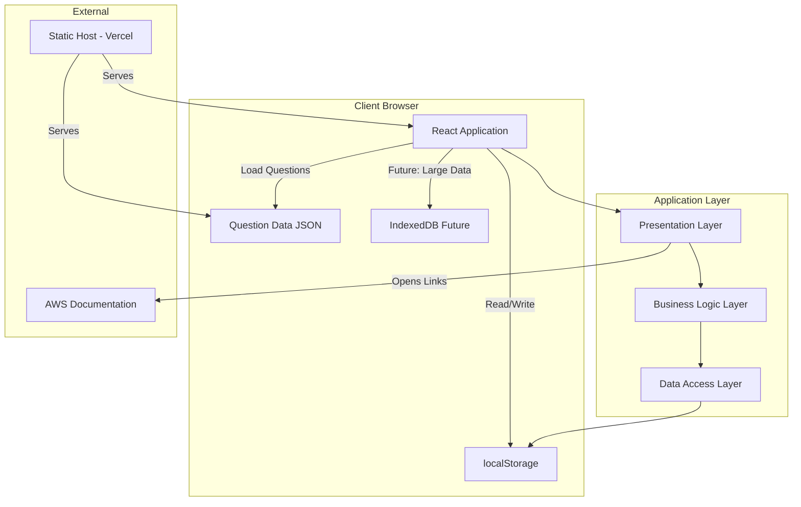

#### 5.2.2 Application Architecture

**Layered Architecture:**

1. **Presentation Layer** (Components)
   - UI Components
   - Pages/Views
   - Layout components
   - Responsible for: Rendering, user input, visual feedback

2. **Business Logic Layer** (Services/Hooks)
   - Exam engine logic
   - Scoring calculations
   - Timer management
   - Question randomization
   - Analytics computation
   - Responsible for: Business rules, calculations, workflow

3. **Data Access Layer** (Utils/Services)
   - localStorage operations
   - Question data loading
   - Data serialization/deserialization
   - Data validation
   - Responsible for: Data persistence, retrieval, caching

**Component Architecture:**

```
app/
├── (routes)/
│   ├── page.tsx                    # Home/Landing
│   ├── layout.tsx                  # Root layout
│   │
│   ├── exam/
│   │   ├── setup/
│   │   │   └── page.tsx           # Exam configuration
│   │   ├── [examId]/
│   │   │   └── page.tsx           # Active exam interface
│   │   └── results/
│   │       └── [examId]/
│   │           └── page.tsx       # Results page
│   │
│   ├── history/
│   │   └── page.tsx               # Exam history
│   │
│   ├── study/
│   │   └── page.tsx               # Study mode
│   │
│   └── bookmarks/
│       └── page.tsx               # Bookmarked questions
│
├── api/
│   ├── questions/
│   │   └── route.ts               # GET questions
│   ├── exam/
│   │   ├── create/route.ts        # POST create exam
│   │   └── submit/route.ts        # POST submit exam
│   ├── history/
│   │   ├── route.ts               # GET/POST history
│   │   └── [id]/route.ts          # GET specific exam
│   ├── export/
│   │   └── route.ts               # GET export data
│   └── session/
│       └── route.ts               # GET/POST session
│
├── components/
│   ├── layout/
│   │   ├── Header.tsx
│   │   ├── Footer.tsx
│   │   └── ExamLayout.tsx
│   │
│   ├── exam/
│   │   ├── QuestionCard.tsx       # Client Component
│   │   ├── AnswerOptions.tsx      # Client Component
│   │   ├── Timer.tsx              # Client Component
│   │   ├── ProgressBar.tsx
│   │   ├── Navigation.tsx         # Client Component
│   │   ├── ReviewSummary.tsx
│   │   └── MarkForReview.tsx
│   │
│   ├── results/
│   │   ├── ResultsSummary.tsx
│   │   ├── PassFailBadge.tsx
│   │   ├── ScoreBreakdown.tsx
│   │   ├── DomainChart.tsx
│   │   └── DetailedReview.tsx
│   │
│   ├── history/
│   │   ├── HistoryDashboard.tsx
│   │   ├── HistoryList.tsx
│   │   └── PerformanceChart.tsx
│   │
│   ├── study/
│   │   ├── StudyMode.tsx          # Client Component
│   │   ├── FilterPanel.tsx        # Client Component
│   │   ├── AnswerReveal.tsx
│   │   └── CustomQuizBuilder.tsx  # Client Component
│   │
│   └── ui/                        # shadcn/ui components
│       ├── button.tsx
│       ├── card.tsx
│       ├── dialog.tsx
│       ├── select.tsx
│       ├── checkbox.tsx
│       ├── radio-group.tsx
│       ├── progress.tsx
│       ├── toast.tsx
│       └── ... (other shadcn components)
│
├── lib/
│   ├── actions/                   # Server Actions
│   │   ├── exam-actions.ts
│   │   ├── history-actions.ts
│   │   └── session-actions.ts
│   │
│   ├── services/
│   │   ├── examEngine.ts
│   │   ├── scoringService.ts
│   │   ├── fileStorage.ts
│   │   ├── questionService.ts
│   │   └── analyticsService.ts
│   │
│   ├── utils/
│   │   ├── randomization.ts
│   │   ├── validation.ts
│   │   ├── formatters.ts
│   │   └── cn.ts                 # Tailwind class merge utility
│   │
│   └── types/
│       ├── question.types.ts
│       ├── exam.types.ts
│       ├── result.types.ts
│       └── index.ts
│
├── contexts/
│   ├── ExamContext.tsx            # Client-side context
│   └── TimerContext.tsx           # Client-side context
│
├── hooks/
│   ├── useTimer.ts
│   ├── useExamEngine.ts
│   ├── useKeyboardShortcuts.ts
│   └── useAnalytics.ts
│
data/                              # Server-side data (not in app/)
├── questions/
│   ├── cloud-concepts.json
│   ├── security.json
│   ├── technology.json
│   ├── billing.json
│   └── index.json
│
└── history/
    └── {sessionId}.json          # Per-session history

public/
└── ... (static assets)

.env.local                         # Environment variables
next.config.js                     # Next.js configuration
tailwind.config.js                 # Tailwind configuration
components.json                    # shadcn/ui configuration
```

#### 5.2.3 Data Flow Architecture

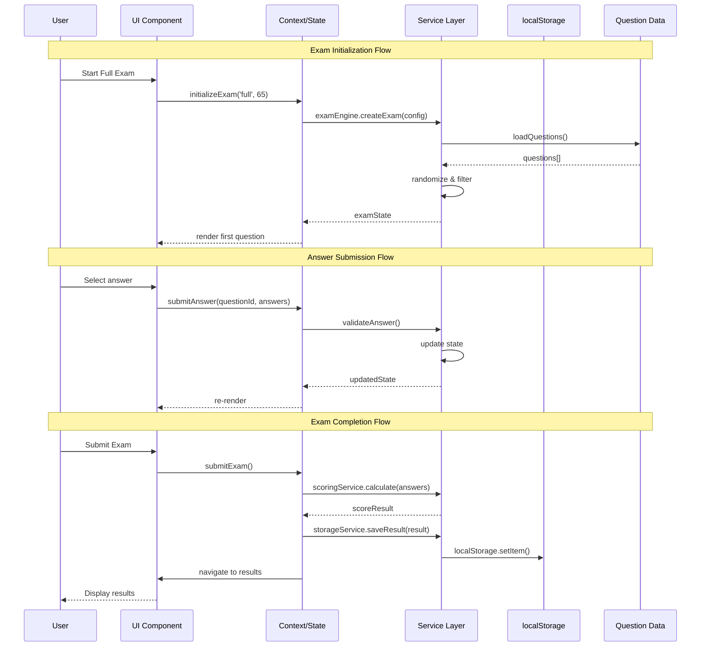

#### 5.2.4 State Management Architecture

**Context Structure:**

```typescript
// ExamContext - Manages active exam state
interface ExamContextType {
  // Exam Configuration
  examMode: 'full' | 'quick' | 'study' | null;
  questionCount: number;
  timeLimit: number;
  
  // Current State
  currentQuestionIndex: number;
  questions: Question[];
  userAnswers: Map<string, number[]>;
  markedForReview: Set<string>;
  startTime: number;
  endTime: number | null;
  
  // Timer
  timerState: TimerState;
  
  // Actions
  initializeExam: (config: ExamConfig) => void;
  navigateToQuestion: (index: number) => void;
  submitAnswer: (questionId: string, answers: number[]) => void;
  toggleMarkForReview: (questionId: string) => void;
  submitExam: () => Promise<ExamResult>;
  pauseExam: () => void;
  resumeExam: () => void;
}

// HistoryContext - Manages exam history and analytics
interface HistoryContextType {
  // Data
  examHistory: ExamResult[];
  statistics: HistoryStatistics;
  
  // Actions
  loadHistory: () => void;
  getExamById: (id: string) => ExamResult | null;
  deleteExam: (id: string) => void;
  exportHistory: () => void;
  importHistory: (file: File) => Promise<void>;
  clearOldHistory: (daysToKeep: number) => void;
}

// PreferencesContext - User preferences
interface PreferencesContextType {
  // Preferences
  keyboardShortcutsEnabled: boolean;
  soundEnabled: boolean;
  timerWarningsEnabled: boolean;
  autoSaveEnabled: boolean;
  
  // Bookmarks & Notes
  bookmarkedQuestions: Set<string>;
  questionNotes: Map<string, QuestionNote>;
  
  // Actions
  updatePreference: <K extends keyof Preferences>(key: K, value: Preferences[K]) => void;
  toggleBookmark: (questionId: string) => void;
  saveNote: (questionId: string, note: string) => void;
  deleteNote: (questionId: string) => void;
}
```

### 5.3 Data Models and Database Design

#### 5.3.1 Complete Type Definitions

```typescript
// ============================================
// QUESTION MODELS
// ============================================

interface Question {
  id: string;                       // Unique identifier (e.g., "q001")
  questionText: string;             // The question content
  options: string[];                // Array of answer options
  correctAnswers: number[];         // Indices of correct options (0-based)
  multipleAnswers: boolean;         // True if multiple correct answers
  explanation: string;              // Why the answer is correct
  domain: DomainType;               // Which exam domain
  topic: string;                    // Specific topic (e.g., "EC2", "IAM")
  difficulty?: DifficultyLevel;     // Optional difficulty rating
  sourceUrl: string;                // URL to source material
  sourceName: string;               // Name of source (e.g., "AWS Docs")
  tags: string[];                   // Searchable tags
  metadata?: {
    createdAt?: number;
    updatedAt?: number;
    version?: string;
  };
}

type DomainType = 'cloud-concepts' | 'security' | 'technology' | 'billing';
type DifficultyLevel = 'easy' | 'medium' | 'hard';

interface QuestionBank {
  version: string;
  lastUpdated: number;
  totalQuestions: number;
  domainDistribution: Record<DomainType, number>;
  questions: Question[];
}

// ============================================
// EXAM MODELS
// ============================================

interface ExamConfig {
  mode: 'full' | 'quick' | 'study';
  questionCount: number;
  timeLimit: number;              // in seconds, 0 for untimed
  domainFilter?: DomainType;
  difficultyFilter?: DifficultyLevel;
  includeOnlyIncorrect?: boolean; // Only questions previously answered wrong
  includeBookmarked?: boolean;    // Only bookmarked questions
  randomize: boolean;
}

interface ExamState {
  id: string;
  config: ExamConfig;
  questions: Question[];
  currentQuestionIndex: number;
  userAnswers: Record<string, number[]>;  // questionId -> selected indices
  markedForReview: string[];              // questionIds
  startTime: number;
  endTime: number | null;
  timerState: TimerState;
  isComplete: boolean;
  questionStartTimes: Record<string, number>; // Track time per question
}

interface TimerState {
  startTime: number;
  duration: number;
  remainingTime: number;
  isRunning: boolean;
  isPaused: boolean;
  warnings: {
    fifteenMinute: boolean;
    fiveMinute: boolean;
  };
}

// ============================================
// RESULT MODELS
// ============================================

interface ExamResult {
  id: string;
  timestamp: number;
  examMode: 'full' | 'quick' | 'study';
  configuration: ExamConfig;
  questions: QuestionAttempt[];
  score: ScoreBreakdown;
  timeTaken: number;                    // total seconds
  averageTimePerQuestion: number;       // seconds
  completed: boolean;
  submittedAt: number;
}

interface QuestionAttempt {
  questionId: string;
  question: Question;                   // Full question data for historical review
  userAnswers: number[];
  correctAnswers: number[];
  isCorrect: boolean;
  timeSpent: number;                    // seconds on this question
  wasMarkedForReview: boolean;
  domain: DomainType;
}

interface ScoreBreakdown {
  totalQuestions: number;
  correctAnswers: number;
  incorrectAnswers: number;
  unansweredQuestions: number;
  rawScore: number;                     // count of correct
  percentageScore: number;              // 0-100
  scaledScore: number;                  // 100-1000 (AWS style)
  passFail: 'pass' | 'fail';
  domainScores: DomainScores;
}

interface DomainScores {
  cloudConcepts: DomainScore;
  security: DomainScore;
  technology: DomainScore;
  billing: DomainScore;
}

interface DomainScore {
  domain: DomainType;
  questionsInDomain: number;
  correctInDomain: number;
  percentageScore: number;
  scaledScore: number;
}

// ============================================
// HISTORY & ANALYTICS MODELS
// ============================================

interface ExamHistory {
  results: ExamResult[];
  statistics: HistoryStatistics;
  lastUpdated: number;
}

interface HistoryStatistics {
  totalExams: number;
  totalQuestions: number;
  averageScore: number;
  bestScore: number;
  worstScore: number;
  passRate: number;                     // percentage of passed exams
  averageTimePerExam: number;
  improvementRate: number;              // percentage points per attempt
  domainAverages: DomainScores;
  recentTrend: 'improving' | 'declining' | 'stable';
  estimatedReadiness: number;           // 0-100 scale
}

interface PerformanceAnalytics {
  scoreProgression: ScoreDataPoint[];
  domainComparison: DomainComparisonData[];
  timeManagement: TimeManagementData;
  questionPatterns: QuestionPatternData;
  insights: PerformanceInsights[];
}

interface ScoreDataPoint {
  attemptNumber: number;
  timestamp: number;
  score: number;
  passed: boolean;
}

interface DomainComparisonData {
  domain: DomainType;
  averageScore: number;
  bestScore: number;
  consistency: number;                  // standard deviation
  questionsAttempted: number;
  accuracy: number;
}

interface TimeManagementData {
  averageTimePerQuestion: number;
  timeDistribution: {
    domain: DomainType;
    averageTime: number;
  }[];
  questionsOverTime: string[];          // questionIds that take > avg time
  efficiency: 'excellent' | 'good' | 'needs-improvement';
}

interface QuestionPatternData {
  frequentlyMissed: {
    questionId: string;
    timesAttempted: number;
    timesIncorrect: number;
    missRate: number;
  }[];
  neverAttempted: string[];
  consistentlyCorrect: string[];
  topicWeakness: {
    topic: string;
    missRate: number;
    questionsAffected: number;
  }[];
}

interface PerformanceInsights {
  type: 'strength' | 'weakness' | 'improvement' | 'plateau';
  domain?: DomainType;
  message: string;
  actionable: string;                   // Recommended action
  priority: 'high' | 'medium' | 'low';
}

// ============================================
// USER DATA MODELS
// ============================================

interface UserPreferences {
  keyboardShortcutsEnabled: boolean;
  soundEnabled: boolean;
  timerWarningsEnabled: boolean;
  autoSaveEnabled: boolean;
  defaultExamMode: 'full' | 'quick' | 'study';
  defaultQuestionCount: number;
  theme: 'light' | 'dark';              // for future
}

interface QuestionNote {
  questionId: string;
  note: string;
  createdAt: number;
  updatedAt: number;
  tags: string[];
}

interface BookmarkData {
  questionId: string;
  bookmarkedAt: number;
  performanceHistory: {
    attemptCount: number;
    correctCount: number;
    lastAttemptDate: number;
  };
}

// ============================================
// LOCAL STORAGE SCHEMA
// ============================================

interface LocalStorageSchema {
  version: string;                      // Schema version for migration
  lastUpdated: number;
  examHistory: ExamResult[];
  userPreferences: UserPreferences;
  bookmarkedQuestions: BookmarkData[];
  questionNotes: QuestionNote[];
  inProgressExam: ExamState | null;     // Resume functionality
}
```

#### 5.3.2 Data Relationships

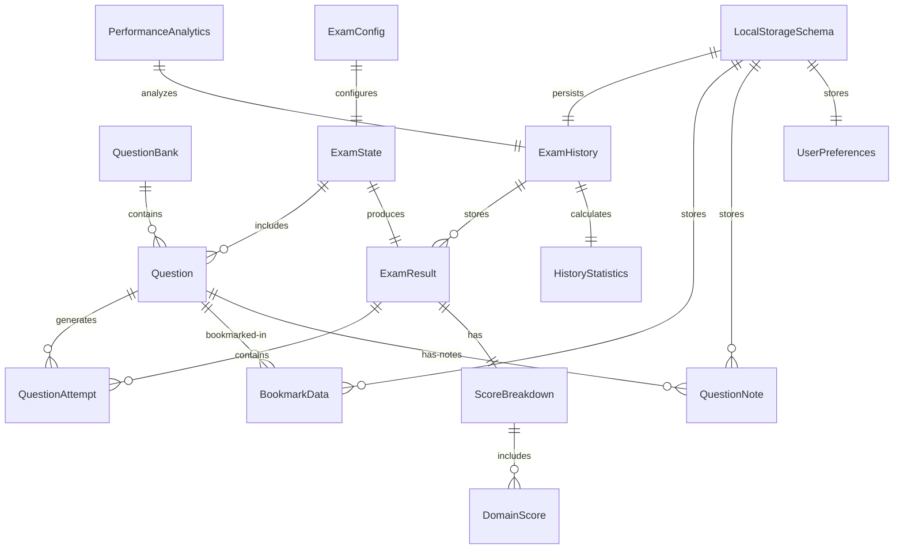

### 5.4 Performance Requirements

#### 5.4.1 Response Time Expectations

**Critical Operations:**
- Initial application load: < 2 seconds
- Question navigation (next/previous): < 100ms
- Answer selection feedback: < 50ms
- Timer update: < 16ms (60fps)
- Submit exam and calculate score: < 500ms
- Load history dashboard: < 300ms
- Generate charts: < 500ms

**Data Loading:**
- Load question bank JSON: < 1 second
- localStorage read operations: < 50ms
- localStorage write operations: < 100ms

**User Experience:**
- Time to interactive (TTI): < 3 seconds
- First contentful paint (FCP): < 1.5 seconds
- Largest contentful paint (LCP): < 2.5 seconds
- Cumulative layout shift (CLS): < 0.1
- First input delay (FID): < 100ms

#### 5.4.2 Optimization Strategies

**Code Splitting:**
```typescript
// Lazy load routes
const Results = lazy(() => import('./pages/Results'));
const History = lazy(() => import('./pages/History'));
const Study = lazy(() => import('./pages/Study'));

// Lazy load heavy components
const PerformanceChart = lazy(() => import('./components/history/PerformanceChart'));
```

**Memoization:**
```typescript
// Memoize expensive calculations
const scoredResults = useMemo(() => 
  calculateScores(examResults), 
  [examResults]
);

// Memoize callbacks
const handleAnswerSelect = useCallback((answer: number) => {
  submitAnswer(currentQuestion.id, answer);
}, [currentQuestion.id, submitAnswer]);
```

**Virtual Scrolling:**
- For long lists (history, question review)
- Render only visible items
- Reduce DOM nodes

**Image Optimization:**
- Use WebP format for images
- Lazy load images
- Compress images before deployment
- Use appropriate sizes for different screens

**Question Data Optimization:**
- Gzip compression on JSON files
- Split questions by domain for lazy loading
- Index questions for faster lookup
- Cache parsed JSON in memory

#### 5.4.3 Concurrent User Support

**Target:**
- Single-user application (no concurrent users)
- Multiple tabs/windows: Supported via localStorage events
- Synchronization between tabs for:
  - Exam history updates
  - Bookmark changes
  - Preference updates

**localStorage Synchronization:**
```typescript
// Listen for storage events from other tabs
useEffect(() => {
  const handleStorageChange = (e: StorageEvent) => {
    if (e.key === 'awsExamPrep' && e.newValue) {
      const newData = JSON.parse(e.newValue);
      updateLocalState(newData);
    }
  };
  
  window.addEventListener('storage', handleStorageChange);
  return () => window.removeEventListener('storage', handleStorageChange);
}, []);
```

#### 5.4.4 Resource Utilization Targets

**Memory:**
- Initial memory footprint: < 50MB
- Peak memory usage: < 150MB
- Question data in memory: ~2-5MB
- Prevent memory leaks: Clean up event listeners, intervals

**CPU:**
- Idle CPU usage: < 1%
- Active exam CPU usage: < 10%
- Timer updates: Efficient, no unnecessary re-renders

**Network:**
- Initial load: < 1MB (gzipped)
- Question data: ~500KB (gzipped)
- No runtime network requests (except opening source URLs)

**Storage:**
- localStorage usage: Monitor and stay under 5MB
- Question bank JSON: ~1-2MB uncompressed
- Exam history: ~10KB per exam

### 5.5 Security Requirements

#### 5.5.1 Data Protection

**Client-Side Security:**
- No sensitive user data collected
- All data stored locally in browser
- No authentication required
- No API keys or credentials needed
- No external data transmission

**Data Privacy:**
- No analytics tracking (unless explicitly added)
- No cookies (except localStorage)
- No third-party scripts
- No personal identifiable information (PII) collected

**localStorage Security:**
- Data stored unencrypted (acceptable for practice exams)
- User responsible for device security
- Clear data deletion functionality
- Export feature for user backup control

#### 5.5.2 Content Security

**Question Integrity:**
- Questions loaded from trusted static files
- No user-generated questions
- No inline script execution
- Content Security Policy (CSP) headers

**Source Attribution:**
- All questions cite sources
- Links to official AWS documentation
- Disclaimers about unofficial content
- Copyright compliance

#### 5.5.3 Application Security

**Input Validation:**
- Validate user answers (array indices)
- Validate JSON imports
- Sanitize any user-entered text (notes)
- Prevent XSS in note content

**Error Handling:**
- Graceful error messages
- Error boundaries for React components
- localStorage error handling
- JSON parse error handling

**Security Headers (Hosting):**
```
Content-Security-Policy: default-src 'self'; script-src 'self'; style-src 'self' 'unsafe-inline'
X-Content-Type-Options: nosniff
X-Frame-Options: DENY
X-XSS-Protection: 1; mode=block
Referrer-Policy: strict-origin-when-cross-origin
```

### 5.6 Deployment & Maintenance

#### 5.6.1 Deployment Strategy

**Recommended Platform: Vercel**

**Why Vercel:**
- Built by Next.js creators (optimal integration)
- Zero-configuration deployment for Next.js
- Automatic HTTPS and SSL certificates
- Global CDN with Edge Network
- Serverless Functions for API routes
- Git integration (auto-deploy on push)
- Preview deployments for every PR
- Free tier sufficient for personal use
- Built-in analytics and monitoring
- Excellent performance worldwide

**Deployment Steps:**
1. Connect GitHub repository to Vercel
2. Vercel auto-detects Next.js configuration
3. Configure build settings (auto-configured):
   - Framework Preset: Next.js
   - Build Command: `next build`
   - Output Directory: `.next`
   - Install Command: `npm install`
4. Set environment variables:
   - `NEXT_PUBLIC_APP_NAME`
   - `NEXT_PUBLIC_APP_VERSION`
   - `SESSION_SECRET` (for session encryption)
5. Deploy automatically on every push to main
6. Preview deployments for PRs

**Alternative Platforms:**

1. **Netlify**
   - Similar to Vercel
   - Drag-and-drop deployment
   - Form handling (for future features)
   - Serverless functions support

2. **GitHub Pages**
   - Free for public repos
   - Requires manual build process
   - Good for simple static hosting
   - Limited to static content

3. **AWS Amplify**
   - Fitting for AWS exam prep app
   - Next.js SSR support
   - Full AWS integration
   - More configuration required
   - Free tier available
   
4. **Self-Hosted (Node.js)**
   - Full control over infrastructure
   - Requires server management
   - Can use any VPS (DigitalOcean, Linode)
   - Need to configure reverse proxy (Nginx)
   - Manual SSL certificate management

#### 5.6.2 Build Configuration

**Next.js Configuration (`next.config.js`):**
```javascript
/** @type {import('next').NextConfig} */
const nextConfig = {
  reactStrictMode: true,
  
  // Optimize production build
  swcMinify: true,
  
  // Experimental features
  experimental: {
    serverActions: true,
  },
  
  // Image optimization
  images: {
    domains: [],
    formats: ['image/avif', 'image/webp'],
  },
  
  // Headers for security
  async headers() {
    return [
      {
        source: '/:path*',
        headers: [
          {
            key: 'X-Frame-Options',
            value: 'DENY',
          },
          {
            key: 'X-Content-Type-Options',
            value: 'nosniff',
          },
          {
            key: 'Referrer-Policy',
            value: 'strict-origin-when-cross-origin',
          },
        ],
      },
    ];
  },
  
  // Environment variables validation
  env: {
    NEXT_PUBLIC_APP_NAME: process.env.NEXT_PUBLIC_APP_NAME,
    NEXT_PUBLIC_APP_VERSION: process.env.NEXT_PUBLIC_APP_VERSION,
  },
};

module.exports = nextConfig;
```

**Package.json Scripts:**
```json
{
  "scripts": {
    "dev": "next dev",
    "build": "next build",
    "start": "next start",
    "lint": "next lint",
    "format": "prettier --write \"app/**/*.{ts,tsx,css}\"",
    "type-check": "tsc --noEmit"
  }
}
```

**Tailwind Configuration (`tailwind.config.js`):**
```javascript
/** @type {import('tailwindcss').Config} */
module.exports = {
  darkMode: ["class"],
  content: [
    './pages/**/*.{ts,tsx}',
    './components/**/*.{ts,tsx}',
    './app/**/*.{ts,tsx}',
    './src/**/*.{ts,tsx}',
  ],
  theme: {
    extend: {
      colors: {
        // AWS Color Palette
        'aws-dark': '#232F3E',
        'aws-orange': '#FF9900',
        'aws-light': '#F7F7F7',
      },
    },
  },
  plugins: [require("tailwindcss-animate")],
}
```

**shadcn/ui Configuration (`components.json`):**
```json
{
  "$schema": "https://ui.shadcn.com/schema.json",
  "style": "default",
  "rsc": true,
  "tsx": true,
  "tailwind": {
    "config": "tailwind.config.js",
    "css": "app/globals.css",
    "baseColor": "slate",
    "cssVariables": true
  },
  "aliases": {
    "components": "@/components",
    "utils": "@/lib/utils"
  }
}
```

#### 5.6.3 Environment Configurations

**Development:**
- Hot module replacement (HMR)
- Source maps enabled
- Console logs enabled
- React DevTools support
- Relaxed linting

**Production:**
- Minified code
- Tree-shaking
- Code splitting
- Compressed assets (gzip/brotli)
- Console logs removed
- Optimized bundle size

**Environment Variables (.env.local):**
```
# Public variables (accessible in browser)
NEXT_PUBLIC_APP_NAME="AWS Cloud Practitioner Exam Prep"
NEXT_PUBLIC_APP_VERSION="1.0.0"
NEXT_PUBLIC_QUESTIONS_VERSION="1.0.0"

# Server-only variables (not exposed to browser)
SESSION_SECRET="your-secret-key-here"
DATA_DIR="./data"
```

#### 5.6.4 Monitoring and Logging

**Error Tracking:**
- React Error Boundaries
- Console error logging (development)
- User-friendly error messages (production)
- localStorage error handling

**Performance Monitoring:**
- Browser DevTools Performance tab
- Lighthouse audits
- Core Web Vitals tracking
- Bundle size monitoring

**Optional (Future):**
- Sentry for error tracking
- Google Analytics for usage
- Vercel Analytics

#### 5.6.5 Maintenance Windows

**Question Updates:**
- Quarterly review of questions
- Update outdated service information
- Add new AWS services/features
- Fix reported incorrect answers
- Version control for question bank

**Application Updates:**
- Dependency updates: Monthly
- Security patches: As needed
- React/TypeScript version upgrades: Annually
- Feature additions: As needed

**Data Migration:**
- localStorage schema versioning
- Migration scripts for breaking changes
- Backward compatibility for 1 version
- User notification of required updates

#### 5.6.6 Backup and Recovery

**User Data:**
- Export functionality for exam history
- Import functionality for restore
- User responsible for backups
- Instructions for data export on initial load

**Question Data:**
- Version control in Git
- Backup JSON files
- Maintain previous versions
- Ability to rollback questions

**Disaster Recovery:**
- GitHub repository as source of truth
- Vercel maintains deployment history
- Can redeploy from any commit
- Question bank versioned separately

---

## 6. User Experience

### 6.1 User Interface Guidelines

#### 6.1.1 Design Principles

**1. Authenticity**
- Mimic AWS certification exam interface
- Professional, clean aesthetic
- Minimal distractions during exam mode
- Focus on content over decoration

**2. Clarity**
- Clear typography with excellent readability
- Obvious interactive elements
- Consistent button styles and colors
- Unambiguous question presentation

**3. Efficiency**
- Quick navigation between questions
- Keyboard shortcuts for power users
- Minimal clicks to complete tasks
- Fast loading and responsive interactions

**4. Feedback**
- Immediate visual feedback for interactions
- Clear indication of saved states
- Progress indicators for long operations
- Confirmation dialogs for destructive actions

**5. Consistency**
- Uniform component styling throughout
- Consistent navigation patterns
- Predictable behavior across features
- Standard iconography

#### 6.1.2 Color Palette

**Primary Colors (AWS Inspired):**
```
--primary-bg:      #FFFFFF    (White)
--secondary-bg:    #F7F7F7    (Light Gray)
--tertiary-bg:     #ECF0F1    (Very Light Gray)
--text-primary:    #232F3E    (AWS Dark Blue)
--text-secondary:  #545B64    (Medium Gray)
--accent-primary:  #FF9900    (AWS Orange)
--accent-hover:    #EC7211    (Dark Orange)
```

**Status Colors:**
```
--success:         #27AE60    (Green)
--success-light:   #D4EDDA    (Light Green)
--error:           #E74C3C    (Red)
--error-light:     #F8D7DA    (Light Red)
--warning:         #F39C12    (Orange/Yellow)
--warning-light:   #FFF3CD    (Light Yellow)
--info:            #3498DB    (Blue)
--info-light:      #D1ECF1    (Light Blue)
```

**Interactive States:**
```
--button-default:  #232F3E
--button-hover:    #161E2B
--button-active:   #0A111C
--button-disabled: #BDC3C7

--link-default:    #3498DB
--link-hover:      #2980B9
--link-visited:    #8E44AD
```

**Exam Interface Specific:**
```
--question-bg:     #FFFFFF
--option-default:  #F8F9FA
--option-hover:    #E9ECEF
--option-selected: #3498DB
--marked-review:   #FFF3CD
--timer-normal:    #232F3E
--timer-warning:   #F39C12
--timer-critical:  #E74C3C
```

#### 6.1.3 Typography

**Font Stack:**
```css
--font-primary: -apple-system, BlinkMacSystemFont, 'Segoe UI', 'Roboto', 
                'Helvetica Neue', Arial, sans-serif;
--font-mono: 'Courier New', Courier, monospace;
```

**Font Sizes:**
```
--text-xs:   12px  /* Labels, captions */
--text-sm:   14px  /* Secondary text, options */
--text-base: 16px  /* Body text, questions */
--text-lg:   18px  /* Timer, important info */
--text-xl:   20px  /* Section headers */
--text-2xl:  24px  /* Page titles */
--text-3xl:  30px  /* Hero text, scores */
--text-4xl:  36px  /* Large numbers */
```

**Font Weights:**
```
--font-normal:    400
--font-medium:    500
--font-semibold:  600
--font-bold:      700
```

**Line Heights:**
```
--leading-tight:  1.25
--leading-normal: 1.5
--leading-relaxed: 1.75
```

#### 6.1.4 Spacing System

**Consistent spacing scale (based on 4px):**
```
--space-1:  4px
--space-2:  8px
--space-3:  12px
--space-4:  16px
--space-5:  20px
--space-6:  24px
--space-8:  32px
--space-10: 40px
--space-12: 48px
--space-16: 64px
--space-20: 80px
```

**Component Spacing:**
- Between options: 16px (space-4)
- Between questions elements: 24px (space-6)
- Page margins: 32px (space-8)
- Section spacing: 48px (space-12)

#### 6.1.5 Layout Guidelines

**Exam Interface Layout:**
```
┌───────────────────────────────────────────────┐
│ Header (60px)                                 │
│ App Title              Timer: 01:23:45        │
├───────────────────────────────────────────────┤
│                                               │
│  ┌─────────────────────────────────────────┐ │
│  │ Progress: [●●●●○○○○] 5/65    ⚑ 2 Marked│ │
│  └─────────────────────────────────────────┘ │
│                                               │
│  ┌─────────────────────────────────────────┐ │
│  │ Question 5 of 65              ⚑ Mark    │ │
│  │                                          │ │
│  │ [Question Text - max 800px width]       │ │
│  │                                          │ │
│  │ [ ] Option A                            │ │
│  │ [ ] Option B                            │ │
│  │ [ ] Option C                            │ │
│  │ [ ] Option D                            │ │
│  │                                          │ │
│  │ ℹ Source: AWS Docs (expandable)        │ │
│  └─────────────────────────────────────────┘ │
│                                               │
├───────────────────────────────────────────────┤
│ Navigation (80px)                             │
│ [◄ Previous]  [Review All]  [Next ►]        │
└───────────────────────────────────────────────┘
```

**Responsive Breakpoints:**
```
--mobile:   < 640px   (Not primary focus)
--tablet:   640-1024px (Functional)
--desktop:  > 1024px   (Optimized)
--wide:     > 1440px   (Max content width)
```

### 6.2 Accessibility Standards

#### 6.2.1 WCAG 2.1 Level AA Compliance

**Color Contrast:**
- Text contrast ratio: Minimum 4.5:1 for normal text
- Large text contrast: Minimum 3:1 for 18px+ or 14px+ bold
- Interactive elements: Minimum 3:1 contrast with background

**Keyboard Navigation:**
- All functionality accessible via keyboard
- Visible focus indicators (2px blue outline)
- Logical tab order
- Skip navigation links
- Keyboard shortcuts clearly documented

**Screen Reader Support:**
- Semantic HTML elements
- ARIA labels for interactive elements
- ARIA live regions for dynamic content
- Alt text for all images
- Descriptive link text

#### 6.2.2 ARIA Implementation

**Example ARIA Usage:**
```html
<!-- Question card -->
<div role="region" aria-labelledby="question-5">
  <h2 id="question-5">Question 5 of 65</h2>
  <fieldset>
    <legend>Select the correct answer:</legend>
    <div role="radiogroup" aria-label="Answer options">
      <label>
        <input type="radio" name="q5" value="0" 
               aria-describedby="option-a-text">
        <span id="option-a-text">Amazon VPC</span>
      </label>
    </div>
  </fieldset>
</div>

<!-- Timer -->
<div role="timer" aria-live="off" aria-atomic="true">
  <span id="timer-label">Time remaining:</span>
  <span aria-labelledby="timer-label">01:23:45</span>
</div>

<!-- Progress indicator -->
<div role="progressbar" 
     aria-valuenow="5" 
     aria-valuemin="0" 
     aria-valuemax="65"
     aria-label="Question progress">
  5 of 65 questions answered
</div>

<!-- Mark for review -->
<button 
  aria-pressed="false"
  aria-label="Mark question 5 for review">
  ⚑ Mark for Review
</button>
```

#### 6.2.3 Keyboard Shortcuts

**Focus Management:**
- Trap focus in modals
- Return focus after modal close
- Skip to main content link
- Focus first input on page load

**Visual Focus Indicators:**
```css
*:focus {
  outline: 2px solid #3498DB;
  outline-offset: 2px;
}

button:focus-visible {
  box-shadow: 0 0 0 3px rgba(52, 152, 219, 0.3);
}
```

#### 6.2.4 Inclusive Design

**Motion Preferences:**
- Respect `prefers-reduced-motion`
- Disable animations for users who prefer reduced motion
- Essential motion only

**Text Scaling:**
- Support browser zoom up to 200%
- Responsive text sizes
- No horizontal scrolling at 200% zoom
- Readable at all sizes

**Alternative Inputs:**
- Touch targets minimum 44x44px
- Mouse and keyboard equivalents
- Voice control friendly
- No time-based interactions (except exam timer)

### 6.3 Interaction Flows

#### 6.3.1 Primary User Journey

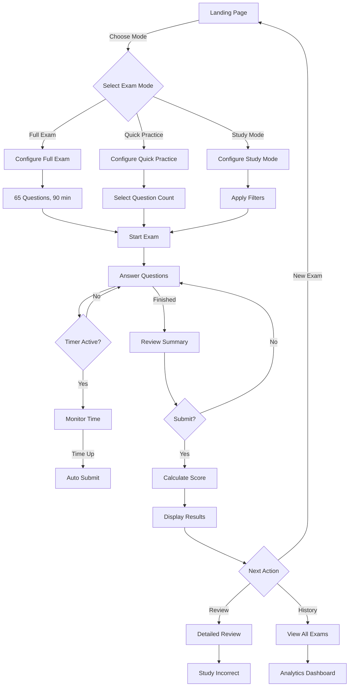

#### 6.3.2 Question Interaction Flow

**Single Answer Question:**
1. User reads question
2. User clicks/taps option
3. Option highlights immediately
4. Previous selection deselected
5. Answer stored in state
6. User can change answer anytime
7. User navigates to next question

**Multiple Answer Question:**
1. User reads "Select ALL that apply" header
2. User clicks/taps multiple options
3. Each selection toggles independently
4. Selected options highlighted
5. User can change selections anytime
6. User navigates to next question

**Mark for Review:**
1. User unsure of answer
2. Clicks "Mark for Review" button/flag
3. Visual indicator added (yellow background)
4. Question flagged in progress tracker
5. Can be toggled on/off
6. Appears in review summary

#### 6.3.3 Error States and Recovery

**localStorage Full:**
```
┌─────────────────────────────────────────────┐
│  ⚠ Storage Space Low                       │
├─────────────────────────────────────────────┤
│  Your exam history is using 4.8MB of       │
│  5MB available space. Please export and    │
│  clear old data to continue.               │
│                                             │
│  [Export History] [Clear Old Data] [Cancel]│
└─────────────────────────────────────────────┘
```

**Network Error (Loading Questions):**
```
┌─────────────────────────────────────────────┐
│  ✗ Unable to Load Questions                │
├─────────────────────────────────────────────┤
│  Could not load the question bank.         │
│  Please check your connection and reload.  │
│                                             │
│  [Retry] [Use Cached Data] [Report Issue]  │
└─────────────────────────────────────────────┘
```

**Unsaved Progress Warning:**
```
┌─────────────────────────────────────────────┐
│  ⚠ Unsaved Progress                        │
├─────────────────────────────────────────────┤
│  You have an exam in progress. Leaving     │
│  will discard your answers.                │
│                                             │
│  [Continue Exam] [Discard and Leave]       │
└─────────────────────────────────────────────┘
```

### 6.4 Component Design Patterns

#### 6.4.1 Button Styles

**Primary Button:**
- Background: AWS Dark Blue (#232F3E)
- Text: White
- Hover: Darker blue
- Padding: 12px 24px
- Border radius: 4px
- Font weight: 600

**Secondary Button:**
- Background: Transparent
- Border: 2px solid #232F3E
- Text: Dark blue
- Hover: Light blue background

**Danger Button:**
- Background: Red (#E74C3C)
- Text: White
- Used for: Delete, Clear, Discard actions

**Disabled Button:**
- Background: Light gray
- Text: Medium gray
- Cursor: not-allowed
- Opacity: 0.6

#### 6.4.2 Modal Patterns

**Confirmation Modal:**
```
┌─────────────────────────────────────────────┐
│  Submit Exam?                               │
├─────────────────────────────────────────────┤
│                                             │
│  You have answered 63 of 65 questions.     │
│  2 questions are unanswered.               │
│  You have 23 minutes remaining.            │
│                                             │
│  Are you sure you want to submit?          │
│                                             │
│         [Cancel] [Yes, Submit Exam]        │
└─────────────────────────────────────────────┘
```

**Modal Behavior:**
- Centered on screen
- Backdrop darkens background
- Focus trapped within modal
- ESC key to close (except confirmations)
- Click outside to close (except confirmations)

#### 6.4.3 Loading States

**Page Loading:**
- Skeleton screens for content areas
- Loading spinner for operations
- Progress bars for long operations

**Skeleton Example:**
```
┌─────────────────────────────────────────────┐
│  ████████████████░░░░░░░░░░                │
│                                             │
│  ░░░░░░░░░░░░░░░░░░░░░░░░░░░░░░░░░░░░░░░░ │
│  ░░░░░░░░░░░░░░░░░░░░░░░░░░░░░░░░░░░░░░░░ │
│                                             │
│  ░░░░░░░░░░░░░░░░░░░░░                     │
│  ░░░░░░░░░░░░░░░░░░░░░                     │
└─────────────────────────────────────────────┘
```

#### 6.4.4 Animation Guidelines

**Subtle Animations:**
- Button hover: 150ms ease
- Modal entrance: 200ms ease-out
- Page transitions: 300ms ease-in-out
- Timer warning: Pulse animation 1s infinite

**Respect Reduced Motion:**
```css
@media (prefers-reduced-motion: reduce) {
  * {
    animation-duration: 0.01ms !important;
    transition-duration: 0.01ms !important;
  }
}
```

---

## 7. Epics and Features

### 7.1 Epic Prioritization

#### Epic 1: Core Exam Engine (Must Have - Priority 1)
**Business Value:** Foundation of entire application  
**Estimated Effort:** 40 hours  
**Impact:** Critical - No app without this  
**Dependencies:** None  

**Includes:**
- Question bank loading and parsing
- Question randomization algorithm
- Answer selection and validation
- Navigation between questions
- Mark for review functionality
- Progress tracking
- Basic scoring calculation

#### Epic 2: Exam Interface (Must Have - Priority 1)
**Business Value:** User-facing exam experience  
**Estimated Effort:** 30 hours  
**Impact:** Critical - Core user experience  
**Dependencies:** Epic 1 (Core Exam Engine)  

**Includes:**
- Question display component
- Answer option rendering
- Timer component
- Progress bar
- Navigation controls
- Review summary screen
- Submit confirmation

#### Epic 3: Scoring and Results (Must Have - Priority 1)
**Business Value:** Exam completion and feedback  
**Estimated Effort:** 25 hours  
**Impact:** Critical - Completing the exam loop  
**Dependencies:** Epic 1, Epic 2  

**Includes:**
- Score calculation (AWS style)
- Domain breakdown
- Pass/fail determination
- Results summary page
- Detailed question review
- Performance charts

#### Epic 4: Exam History and Analytics (Should Have - Priority 2)
**Business Value:** Progress tracking and improvement  
**Estimated Effort:** 30 hours  
**Impact:** High - Key differentiator  
**Dependencies:** Epic 3  

**Includes:**
- localStorage implementation
- Exam history storage
- History dashboard
- Performance analytics
- Trend charts
- Export/import functionality

#### Epic 5: Study Mode and Enhancements (Should Have - Priority 2)
**Business Value:** Flexible learning options  
**Estimated Effort:** 20 hours  
**Impact:** Medium-High - User convenience  
**Dependencies:** Epic 1, Epic 2  

**Includes:**
- Study mode (untimed)
- Answer reveal feature
- Question filtering
- Custom quiz builder
- Domain-specific practice

#### Epic 6: Question Bank Creation (Must Have - Priority 1)
**Business Value:** Content is king  
**Estimated Effort:** 60-80 hours  
**Impact:** Critical - No app without questions  
**Dependencies:** None (can be done in parallel)  

**Includes:**
- Research reputable sources
- Collect 500+ questions
- Verify answers with AWS docs
- Structure questions in JSON
- Add source URLs
- Quality review and validation

#### Epic 7: Bookmarks and Notes (Could Have - Priority 3)
**Business Value:** Personalization and learning aids  
**Estimated Effort:** 15 hours  
**Impact:** Medium - Nice to have feature  
**Dependencies:** Epic 2  

**Includes:**
- Bookmark questions
- Add personal notes
- View bookmarked questions
- Practice bookmarked questions only
- Export notes

#### Epic 8: Keyboard Shortcuts (Could Have - Priority 3)
**Business Value:** Power user feature  
**Estimated Effort:** 10 hours  
**Impact:** Low-Medium - Convenience  
**Dependencies:** Epic 2  

**Includes:**
- Implement keyboard event handlers
- Navigation shortcuts
- Answer selection shortcuts
- Action shortcuts
- Help panel for shortcuts

### 7.2 Feature Breakdown

#### Feature 1.1: Question Data Loading
**Epic:** Core Exam Engine  
**Priority:** Must Have  
**Effort:** 5 story points  

**Description:**
Load question data from JSON files and parse into usable format.

**Acceptance Criteria:**
- [x] Load questions.json on app initialization
- [x] Parse JSON into Question objects
- [x] Handle loading errors gracefully
- [x] Cache questions in memory for session
- [x] Support lazy loading by domain (optional)
- [x] Validate question structure

**Technical Implementation:**
- Fetch API for JSON loading
- JSON schema validation
- Error boundaries for failure handling
- Loading states and indicators

**Definition of Done:**
- Code implemented and tested
- Questions load within 1 second
- Error handling works correctly
- No memory leaks
- Type-safe with TypeScript

#### Feature 1.2: Question Randomization
**Epic:** Core Exam Engine  
**Priority:** Must Have  
**Effort:** 3 story points  

**Description:**
Randomize question order while maintaining domain distribution.

**Acceptance Criteria:**
- [x] Randomize questions for each exam
- [x] Maintain correct domain distribution (26/25/33/16)
- [x] No duplicate questions in single exam
- [x] Support filtering by domain/difficulty
- [x] Deterministic seed for debugging (dev mode)

**Algorithm:**
```typescript
function selectExamQuestions(
  questionBank: Question[],
  config: ExamConfig
): Question[] {
  // 1. Filter by domain/difficulty if specified
  let filteredQuestions = applyFilters(questionBank, config);
  
  // 2. Group by domain
  const byDomain = groupByDomain(filteredQuestions);
  
  // 3. Calculate required questions per domain
  const distribution = calculateDistribution(config.questionCount);
  
  // 4. Randomly select from each domain
  const selected: Question[] = [];
  for (const [domain, count] of Object.entries(distribution)) {
    const domainQuestions = byDomain[domain];
    const randomized = shuffleArray(domainQuestions);
    selected.push(...randomized.slice(0, count));
  }
  
  // 5. Shuffle final selection
  return shuffleArray(selected);
}
```

**Definition of Done:**
- Code implemented and unit tested
- Distribution matches exam blueprint
- No performance issues with 500+ questions
- Works for all exam modes
- Fully typed

#### Feature 1.3: Answer Management
**Epic:** Core Exam Engine  
**Priority:** Must Have  
**Effort:** 3 story points  

**Description:**
Store and manage user answers throughout exam.

**Acceptance Criteria:**
- [x] Store answer selections per question
- [x] Support single and multiple answer questions
- [x] Update answers when user changes selection
- [x] Track answered vs unanswered questions
- [x] Persist answers across navigation
- [x] Clear answers on new exam

**Data Structure:**
```typescript
interface AnswerState {
  [questionId: string]: {
    selectedIndices: number[];
    timestamp: number;
    timeSpent: number;
  };
}
```

**Definition of Done:**
- State management works correctly
- No data loss on navigation
- Performance optimized (no unnecessary re-renders)
- Type-safe
- Unit tests pass

#### Feature 2.1: Question Display Component
**Epic:** Exam Interface  
**Priority:** Must Have  
**Effort:** 5 story points  

**Description:**
Render question with options in AWS exam-like format.

**Acceptance Criteria:**
- [x] Display question text clearly
- [x] Render options with radio/checkbox
- [x] Support single and multiple answer types
- [x] Show question number and total
- [x] Display source link (expandable)
- [x] Indicate multiple answer questions clearly
- [x] Responsive design

**Components:**
- QuestionCard.tsx
- AnswerOptions.tsx
- SourceAttribution.tsx

**Definition of Done:**
- Component renders correctly
- All interactions work
- Accessibility standards met
- Responsive on tablet and desktop
- No console errors

#### Feature 2.2: Timer Component
**Epic:** Exam Interface  
**Priority:** Must Have  
**Effort:** 5 story points  

**Description:**
Countdown timer with visual warnings and auto-submit.

**Acceptance Criteria:**
- [x] Display time in HH:MM:SS format
- [x] Update every second
- [x] Show warning at 15 minutes (yellow)
- [x] Show critical warning at 5 minutes (red)
- [x] Auto-submit when timer reaches 0
- [x] Persist on page refresh (optional)
- [x] Pause/resume in study mode only

**Implementation:**
```typescript
function useTimer(duration: number, onExpire: () => void) {
  const [remainingTime, setRemainingTime] = useState(duration);
  const [isRunning, setIsRunning] = useState(true);
  
  useEffect(() => {
    if (!isRunning || remainingTime <= 0) return;
    
    const interval = setInterval(() => {
      setRemainingTime(prev => {
        if (prev <= 1) {
          onExpire();
          return 0;
        }
        return prev - 1;
      });
    }, 1000);
    
    return () => clearInterval(interval);
  }, [isRunning, remainingTime, onExpire]);
  
  return { remainingTime, isRunning, setIsRunning };
}
```

**Definition of Done:**
- Timer counts down accurately
- Warnings trigger correctly
- Auto-submit works
- No memory leaks
- Performance optimized (no unnecessary renders)

---

## 8. User Stories

### 8.1 Story Structure

All user stories follow the standard format:
```
As a [persona]
I want to [action]
So that [benefit/outcome]
```

**Story Prioritization:**
- **Must Have**: Critical for MVP, cannot launch without
- **Should Have**: Important but not critical, can be added post-MVP
- **Could Have**: Nice to have, lower priority
- **Won't Have**: Out of scope for current version

**Story Points:** Using Fibonacci sequence (1, 2, 3, 5, 8, 13)

### 8.2 Core Exam Stories (Must Have)

#### Story 1: Start Full Practice Exam
**Priority:** Must Have  
**Story Points:** 8  
**Epic:** Core Exam Engine + Exam Interface  

**Story:**
As an AWS exam candidate  
I want to start a full practice exam with 65 questions and 90-minute timer  
So that I can simulate the real AWS Cloud Practitioner certification exam  

**Acceptance Criteria:**
- [ ] User can click "Start Full Exam" from home page
- [ ] System selects 65 random questions with correct domain distribution
- [ ] Timer starts at 90:00:00 and counts down
- [ ] First question displays immediately
- [ ] Progress indicator shows 0/65 questions answered
- [ ] All navigation controls are functional

**Technical Tasks:**
1. Create exam configuration for full mode
2. Implement question selection algorithm
3. Initialize timer component
4. Set up exam context with initial state
5. Render exam interface

#### Story 2: Answer Single-Choice Questions
**Priority:** Must Have  
**Story Points:** 5  
**Epic:** Exam Interface  

**Story:**
As an exam candidate  
I want to select one answer from multiple options  
So that I can answer single-choice questions correctly  

**Acceptance Criteria:**
- [ ] User can click any radio button option
- [ ] Only one option can be selected at a time
- [ ] Selected option highlights immediately
- [ ] Answer is saved automatically
- [ ] User can change answer by clicking different option
- [ ] Selection persists when navigating away and back

**Technical Tasks:**
1. Implement radio button group component
2. Handle selection change events
3. Update answer state in context
4. Apply visual styling for selected state
5. Test with different browsers

#### Story 3: Answer Multiple-Choice Questions
**Priority:** Must Have  
**Story Points:** 5  
**Epic:** Exam Interface  

**Story:**
As an exam candidate  
I want to select multiple answers when a question requires it  
So that I can answer "Select ALL that apply" questions  

**Acceptance Criteria:**
- [ ] Question clearly indicates "Select ALL that apply"
- [ ] User can select multiple checkboxes
- [ ] Each selection toggles independently
- [ ] Selected options highlight
- [ ] All selections saved automatically
- [ ] User can change selections anytime

#### Story 4: Navigate Between Questions
**Priority:** Must Have  
**Story Points:** 3  
**Epic:** Exam Interface  

**Story:**
As an exam candidate  
I want to move forward and backward through questions  
So that I can review and change my answers  

**Acceptance Criteria:**
- [ ] "Next" button advances to next question
- [ ] "Previous" button returns to previous question
- [ ] Navigation works from any question
- [ ] Answers persist across navigation
- [ ] Current question indicator updates
- [ ] Progress bar updates

#### Story 5: Mark Questions for Review
**Priority:** Must Have  
**Story Points:** 3  
**Epic:** Exam Interface  

**Story:**
As an exam candidate  
I want to mark uncertain questions for review  
So that I can return to them before submitting  

**Acceptance Criteria:**
- [ ] "Mark for Review" button visible on each question
- [ ] Click toggles mark on/off
- [ ] Marked questions show visual indicator (flag/color)
- [ ] Progress bar shows marked count
- [ ] Marks persist across navigation
- [ ] Can toggle mark at any time

#### Story 6: Review All Questions Before Submitting
**Priority:** Must Have  
**Story Points:** 5  
**Epic:** Exam Interface  

**Story:**
As an exam candidate  
I want to see summary of all questions and their status  
So that I can ensure I haven't missed any before submitting  

**Acceptance Criteria:**
- [ ] "Review All" button accessible from any question
- [ ] Grid view shows all questions with status icons
- [ ] Answered, unanswered, and marked questions distinguishable
- [ ] Click any question to jump directly to it
- [ ] Filter options (all/answered/unanswered/marked)
- [ ] Submit button prominently displayed

#### Story 7: Submit Exam
**Priority:** Must Have  
**Story Points:** 5  
**Epic:** Exam Interface + Scoring  

**Story:**
As an exam candidate  
I want to submit my completed exam  
So that I can see my score and results  

**Acceptance Criteria:**
- [ ] "Submit Exam" button visible on review screen
- [ ] Confirmation dialog shows warning if questions unanswered
- [ ] Confirmation shows time remaining
- [ ] User must confirm submission
- [ ] Cannot return to exam after submission
- [ ] Immediately redirects to results page

#### Story 8: View Exam Results
**Priority:** Must Have  
**Story Points:** 8  
**Epic:** Scoring and Results  

**Story:**
As an exam candidate  
I want to see my exam score and performance breakdown  
So that I can know if I passed and understand my strengths/weaknesses  

**Acceptance Criteria:**
- [ ] Display overall score (100-1000 scale)
- [ ] Show pass/fail status prominently
- [ ] Display percentage score
- [ ] Show score breakdown by domain
- [ ] Indicate strongest and weakest domains
- [ ] Show time taken
- [ ] Provide option to review detailed answers

#### Story 9: Review Detailed Answers
**Priority:** Must Have  
**Story Points:** 8  
**Epic:** Scoring and Results  

**Story:**
As an exam candidate  
I want to review each question with correct/incorrect indication  
So that I can learn from my mistakes and understand the material  

**Acceptance Criteria:**
- [ ] Navigate through all questions
- [ ] See which questions were correct/incorrect
- [ ] View correct answer for each question
- [ ] Read explanation for correct answer
- [ ] See which options I selected
- [ ] Filter to show only incorrect answers
- [ ] Access source URL for verification

#### Story 10: Monitor Exam Time
**Priority:** Must Have  
**Story Points:** 5  
**Epic:** Exam Interface  

**Story:**
As an exam candidate  
I want to see how much time I have remaining  
So that I can pace myself appropriately  

**Acceptance Criteria:**
- [ ] Timer visible at all times (top-right corner)
- [ ] Display format: HH:MM:SS
- [ ] Timer turns yellow/orange at 15 minutes remaining
- [ ] Timer turns red at 5 minutes remaining
- [ ] Exam auto-submits when timer reaches 0:00:00
- [ ] Warning notification at critical time thresholds

### 8.3 History and Analytics Stories (Should Have)

#### Story 11: View Exam History
**Priority:** Should Have  
**Story Points:** 5  
**Epic:** Exam History and Analytics  

**Story:**
As an exam candidate  
I want to see all my previous exam attempts  
So that I can track my progress over time  

**Acceptance Criteria:**
- [ ] List shows all previous exams chronologically
- [ ] Each entry shows date, score, pass/fail, time taken
- [ ] Can click to view detailed results of past exams
- [ ] Filter by exam type (full/quick/study)
- [ ] Sort by date or score
- [ ] View summary statistics (average, best, worst)

#### Story 12: Track Performance Analytics
**Priority:** Should Have  
**Story Points:** 8  
**Epic:** Exam History and Analytics  

**Story:**
As an exam candidate  
I want to see charts and analytics of my performance  
So that I can identify trends and areas needing improvement  

**Acceptance Criteria:**
- [ ] Line chart shows score progression over time
- [ ] Bar chart compares performance across domains
- [ ] Radar chart visualizes domain strengths
- [ ] Display improvement rate
- [ ] Show readiness estimate
- [ ] Highlight frequently missed questions
- [ ] Identify weak topics

#### Story 13: Export Exam History
**Priority:** Should Have  
**Story Points:** 3  
**Epic:** Exam History and Analytics  

**Story:**
As an exam candidate  
I want to export my exam history as a file  
So that I can back up my data or transfer to another device  

**Acceptance Criteria:**
- [ ] "Export" button in history dashboard
- [ ] Downloads JSON file with all exam data
- [ ] Filename includes timestamp
- [ ] File contains all exams and results
- [ ] Can import exported file to restore data
- [ ] Clear instructions provided

### 8.4 Study Mode Stories (Should Have)

#### Story 14: Practice in Study Mode
**Priority:** Should Have  
**Story Points:** 5  
**Epic:** Study Mode and Enhancements  

**Story:**
As an exam candidate  
I want to practice questions without time pressure  
So that I can focus on learning rather than speed  

**Acceptance Criteria:**
- [ ] Select "Study Mode" from home page
- [ ] No timer active
- [ ] Can take as long as needed per question
- [ ] "Show Answer" button available
- [ ] Answer reveals immediately when requested
- [ ] Can apply filters to select specific questions

#### Story 15: Reveal Answers in Study Mode
**Priority:** Should Have  
**Story Points:** 5  
**Epic:** Study Mode and Enhancements  

**Story:**
As an exam candidate  
I want to see the correct answer and explanation  
So that I can learn immediately without completing the entire quiz  

**Acceptance Criteria:**
- [ ] "Show Answer" button visible in study mode
- [ ] Click reveals correct answer highlighted in green
- [ ] My incorrect selection marked in red
- [ ] Detailed explanation displayed
- [ ] Related documentation links provided
- [ ] Source URL visible for verification

#### Story 16: Filter Questions by Domain
**Priority:** Should Have  
**Story Points:** 3  
**Epic:** Study Mode and Enhancements  

**Story:**
As an exam candidate  
I want to practice questions from a specific domain  
So that I can focus on my weakest areas  

**Acceptance Criteria:**
- [ ] Domain filter available in study mode setup
- [ ] Can select one or multiple domains
- [ ] Question count updates based on filter
- [ ] Only selected domain questions appear
- [ ] Works with other filters (difficulty, performance)

#### Story 17: Create Custom Quiz
**Priority:** Should Have  
**Story Points:** 5  
**Epic:** Study Mode and Enhancements  

**Story:**
As an exam candidate  
I want to create a custom quiz with specific criteria  
So that I can target my study sessions effectively  

**Acceptance Criteria:**
- [ ] Select question count
- [ ] Choose domains to include
- [ ] Set difficulty level
- [ ] Option to include only previously incorrect questions
- [ ] Option for timed or untimed
- [ ] Show available question count based on filters
- [ ] Start quiz with custom configuration

### 8.5 Enhancement Stories (Could Have)

#### Story 18: Bookmark Difficult Questions
**Priority:** Could Have  
**Story Points:** 3  
**Epic:** Bookmarks and Notes  

**Story:**
As an exam candidate  
I want to bookmark questions I find difficult  
So that I can easily practice them again later  

**Acceptance Criteria:**
- [ ] Bookmark button on each question
- [ ] Click toggles bookmark on/off
- [ ] Visual indicator shows bookmarked status
- [ ] View all bookmarked questions in dedicated page
- [ ] Create quiz from bookmarked questions only
- [ ] See performance history for bookmarked questions

#### Story 19: Add Personal Notes to Questions
**Priority:** Could Have  
**Story Points:** 3  
**Epic:** Bookmarks and Notes  

**Story:**
As an exam candidate  
I want to add personal notes to questions  
So that I can record mnemonics or reminders  

**Acceptance Criteria:**
- [ ] "Add Note" button on each question
- [ ] Modal opens for note entry
- [ ] Note saves automatically to localStorage
- [ ] Note displays when viewing question
- [ ] Can edit or delete notes
- [ ] Export notes separately

#### Story 20: Use Keyboard Shortcuts
**Priority:** Could Have  
**Story Points:** 3  
**Epic:** Keyboard Shortcuts  

**Story:**
As a power user  
I want to navigate using keyboard shortcuts  
So that I can complete exams more efficiently  

**Acceptance Criteria:**
- [ ] Arrow keys navigate prev/next question
- [ ] Number keys 1-5 select options
- [ ] 'M' toggles mark for review
- [ ] 'S' shows answer in study mode
- [ ] 'R' opens review summary
- [ ] '?' shows keyboard shortcuts help

### 8.6 Story Mapping

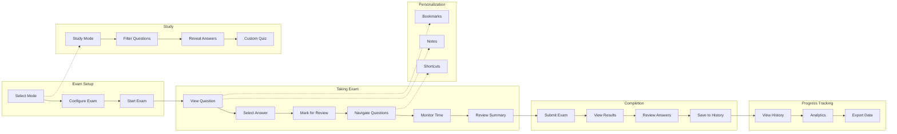

### 8.7 MVP Definition

**Minimum Viable Product includes:**
- Stories 1-10: Complete exam flow (setup, take, submit, results)
- Story 6: Question bank with 500+ verified questions
- Basic UI matching AWS exam interface
- Timer with warnings and auto-submit
- Score calculation and domain breakdown
- Detailed answer review

**Post-MVP (Phase 2):**
- Stories 11-13: History and analytics
- Stories 14-17: Study mode features

**Future Enhancements (Phase 3):**
- Stories 18-20: Bookmarks, notes, shortcuts
- Additional certifications
- Dark mode
- Mobile optimization

---

## 9. Tasks and Implementation

### 9.1 Development Tasks Breakdown

#### Phase 1: Project Setup and Foundation (Week 1 - Days 1-2)

**Task 1.1: Initialize Project**
- [ ] Create GitHub repository
- [ ] Initialize Next.js 14+ with App Router and TypeScript
- [ ] Configure ESLint and Prettier
- [ ] Set up folder structure (app/, lib/, components/)
- [ ] Install core dependencies
- [ ] Configure Tailwind CSS
- [ ] Initialize shadcn/ui (`npx shadcn-ui@latest init`)
- [ ] Create initial README

**Estimated Time:** 3 hours  
**Assignee:** Developer  
**Dependencies:** None  

**Task 1.2: Define TypeScript Types**
- [ ] Create question.types.ts
- [ ] Create exam.types.ts
- [ ] Create result.types.ts
- [ ] Create history.types.ts
- [ ] Export all types from index.ts

**Estimated Time:** 2 hours  
**Assignee:** Developer  
**Dependencies:** Task 1.1  

**Task 1.3: Set Up Routing and API**
- [ ] Create app router structure
- [ ] Set up page routes (app/page.tsx, app/exam/*, app/history/*)
- [ ] Create API routes (app/api/questions, app/api/exam, app/api/history)
- [ ] Test navigation and API endpoints

**Estimated Time:** 3 hours  
**Assignee:** Developer  
**Dependencies:** Task 1.1  

**Task 1.4: Set Up shadcn/ui Components**
- [ ] Install shadcn/ui components (button, card, dialog, select)
- [ ] Install shadcn/ui components (checkbox, radio-group, progress, toast)
- [ ] Create layout components (Header, Footer)
- [ ] Create Loading component
- [ ] Test all UI components

**Estimated Time:** 3 hours  
**Assignee:** Developer  
**Dependencies:** Task 1.1  

#### Phase 2: Core Exam Engine (Week 1 - Days 3-7)

**Task 2.1: Question Service**
- [ ] Create questionService.ts
- [ ] Implement loadQuestions function
- [ ] Add error handling
- [ ] Create question validation
- [ ] Add caching mechanism
- [ ] Test with sample data

**Estimated Time:** 5 hours  
**Assignee:** Developer  
**Dependencies:** Task 1.2  

**Task 2.2: Exam Engine Service**
- [ ] Create examEngine.ts
- [ ] Implement question randomization
- [ ] Add domain distribution logic
- [ ] Create question filtering
- [ ] Implement exam configuration
- [ ] Unit tests for algorithms

**Estimated Time:** 8 hours  
**Assignee:** Developer  
**Dependencies:** Task 2.1  

**Task 2.3: Exam Context**
- [ ] Create ExamContext.tsx
- [ ] Define context state shape
- [ ] Implement state actions
- [ ] Add reducer for complex state
- [ ] Test context functionality

**Estimated Time:** 5 hours  
**Assignee:** Developer  
**Dependencies:** Task 2.2  

**Task 2.4: Scoring Service**
- [ ] Create scoringService.ts
- [ ] Implement score calculation
- [ ] Add domain score breakdown
- [ ] Create AWS-style scaling (100-1000)
- [ ] Add pass/fail logic
- [ ] Unit tests

**Estimated Time:** 4 hours  
**Assignee:** Developer  
**Dependencies:** Task 2.3  

#### Phase 3: Exam Interface (Week 2 - Days 8-12)

**Task 3.1: Timer Component**
- [ ] Create Timer.tsx
- [ ] Implement useTimer custom hook
- [ ] Add countdown logic
- [ ] Implement warning states
- [ ] Add auto-submit on expiry
- [ ] Test timer accuracy

**Estimated Time:** 5 hours  
**Assignee:** Developer  
**Dependencies:** Task 2.3  

**Task 3.2: Question Card Component**
- [ ] Create QuestionCard.tsx
- [ ] Implement question text rendering
- [ ] Add question metadata display
- [ ] Style for AWS exam look
- [ ] Responsive design
- [ ] Accessibility features

**Estimated Time:** 4 hours  
**Assignee:** Developer  
**Dependencies:** Task 2.3  

**Task 3.3: Answer Options Component**
- [ ] Create AnswerOptions.tsx
- [ ] Implement radio button group
- [ ] Implement checkbox group
- [ ] Add selection handling
- [ ] Style selected states
- [ ] Test with various option counts

**Estimated Time:** 5 hours  
**Assignee:** Developer  
**Dependencies:** Task 3.2  

**Task 3.4: Progress Bar Component**
- [ ] Create ProgressBar.tsx
- [ ] Display answered/unanswered count
- [ ] Show marked questions count
- [ ] Visual progress indicator
- [ ] Update on navigation

**Estimated Time:** 3 hours  
**Assignee:** Developer  
**Dependencies:** Task 2.3  

**Task 3.5: Navigation Component**
- [ ] Create Navigation.tsx
- [ ] Implement Previous/Next buttons
- [ ] Add Review All button
- [ ] Handle edge cases (first/last question)
- [ ] Disable buttons appropriately

**Estimated Time:** 3 hours  
**Assignee:** Developer  
**Dependencies:** Task 2.3  

**Task 3.6: Review Summary Component**
- [ ] Create ReviewSummary.tsx
- [ ] Grid layout for all questions
- [ ] Status indicators (answered/unanswered/marked)
- [ ] Jump to question functionality
- [ ] Filter options
- [ ] Submit button

**Estimated Time:** 6 hours  
**Assignee:** Developer  
**Dependencies:** Task 3.2  

**Task 3.7: Exam Interface Page**
- [ ] Create ExamInterface.tsx page
- [ ] Integrate all exam components
- [ ] Handle exam flow logic
- [ ] Test full exam experience
- [ ] Polish UI/UX

**Estimated Time:** 5 hours  
**Assignee:** Developer  
**Dependencies:** Tasks 3.1-3.6  

#### Phase 4: Results and Scoring (Week 2-3 - Days 13-17)

**Task 4.1: Results Summary Component**
- [ ] Create ResultsSummary.tsx
- [ ] Display pass/fail badge
- [ ] Show overall score
- [ ] Domain breakdown chart
- [ ] Time taken display
- [ ] Action buttons (review, new exam, history)

**Estimated Time:** 6 hours  
**Assignee:** Developer  
**Dependencies:** Task 2.4  

**Task 4.2: Performance Chart Component**
- [ ] Install Recharts
- [ ] Create PerformanceChart.tsx
- [ ] Implement bar chart for domains
- [ ] Add radar chart option
- [ ] Responsive design
- [ ] Tooltips and labels

**Estimated Time:** 5 hours  
**Assignee:** Developer  
**Dependencies:** Task 4.1  

**Task 4.3: Detailed Review Component**
- [ ] Create DetailedReview.tsx
- [ ] Display question by question
- [ ] Show correct/incorrect indicators
- [ ] Display explanations
- [ ] Navigation through questions
- [ ] Filter functionality

**Estimated Time:** 6 hours  
**Assignee:** Developer  
**Dependencies:** Task 4.1  

**Task 4.4: Results Page**
- [ ] Create Results.tsx page
- [ ] Integrate results components
- [ ] Handle no-exam-data state
- [ ] Test with various score scenarios
- [ ] Polish presentation

**Estimated Time:** 4 hours  
**Assignee:** Developer  
**Dependencies:** Tasks 4.1-4.3  

#### Phase 5: Storage and History (Week 3 - Days 18-21)

**Task 5.1: File Storage Service**
- [ ] Create fileStorage.ts service
- [ ] Implement save/load functions using fs module
- [ ] Add data validation
- [ ] Handle file errors
- [ ] Implement atomic writes
- [ ] Test file operations

**Estimated Time:** 5 hours  
**Assignee:** Developer  
**Dependencies:** Task 1.2  

**Task 5.2: History API and Server Actions**
- [ ] Create history API routes
- [ ] Implement Server Actions for history operations
- [ ] Load history via Server Components
- [ ] Implement add/delete/clear operations
- [ ] Export/import via API endpoints
- [ ] Calculate statistics

**Estimated Time:** 5 hours  
**Assignee:** Developer  
**Dependencies:** Task 5.1  

**Task 5.3: History Dashboard Component**
- [ ] Create HistoryDashboard.tsx
- [ ] Display statistics panel
- [ ] List all exam attempts
- [ ] Sort and filter options
- [ ] Click to view details

**Estimated Time:** 6 hours  
**Assignee:** Developer  
**Dependencies:** Task 5.2  

**Task 5.4: Analytics Service**
- [ ] Create analyticsService.ts
- [ ] Calculate trends
- [ ] Identify patterns
- [ ] Generate insights
- [ ] Performance metrics

**Estimated Time:** 6 hours  
**Assignee:** Developer  
**Dependencies:** Task 5.2  

**Task 5.5: History Page**
- [ ] Create History.tsx page
- [ ] Integrate dashboard and charts
- [ ] Test with various data scenarios
- [ ] Handle empty state
- [ ] Polish UI

**Estimated Time:** 4 hours  
**Assignee:** Developer  
**Dependencies:** Tasks 5.3-5.4  

#### Phase 6: Study Mode (Week 3-4 - Days 22-25)

**Task 6.1: Study Mode Logic**
- [ ] Add study mode to exam engine
- [ ] Disable timer for study mode
- [ ] Enable answer reveal
- [ ] No final scoring

**Estimated Time:** 3 hours  
**Assignee:** Developer  
**Dependencies:** Task 2.2  

**Task 6.2: Answer Reveal Component**
- [ ] Create AnswerReveal.tsx
- [ ] Show correct answer highlighting
- [ ] Display explanation
- [ ] Show source links
- [ ] Conditional rendering (study mode only)

**Estimated Time:** 4 hours  
**Assignee:** Developer  
**Dependencies:** Task 6.1  

**Task 6.3: Filter Panel Component**
- [ ] Create FilterPanel.tsx
- [ ] Domain checkboxes
- [ ] Difficulty selection
- [ ] Performance-based filters
- [ ] Apply filters button
- [ ] Show available question count

**Estimated Time:** 5 hours  
**Assignee:** Developer  
**Dependencies:** Task 6.1  

**Task 6.4: Custom Quiz Builder**
- [ ] Create CustomQuizBuilder.tsx
- [ ] Integrate filter panel
- [ ] Question count selector
- [ ] Timer option toggle
- [ ] Start quiz button

**Estimated Time:** 4 hours  
**Assignee:** Developer  
**Dependencies:** Task 6.3  

**Task 6.5: Study Page**
- [ ] Create Study.tsx page
- [ ] Integrate study mode components
- [ ] Test study mode flow
- [ ] Polish UI

**Estimated Time:** 3 hours  
**Assignee:** Developer  
**Dependencies:** Tasks 6.1-6.4  

#### Phase 7: Question Bank Creation (Parallel - Weeks 1-3)

**Task 7.1: Research and Source Identification**
- [ ] Identify reputable sources
- [ ] Review AWS official documentation
- [ ] Find practice question platforms
- [ ] Document sources

**Estimated Time:** 8 hours  
**Assignee:** Content Creator / Developer  
**Dependencies:** None  

**Task 7.2: Cloud Concepts Questions (130 questions)**
- [ ] Collect questions on AWS value proposition
- [ ] Cloud economics questions
- [ ] Architecture design principles
- [ ] Verify all answers
- [ ] Add explanations and sources

**Estimated Time:** 18 hours  
**Assignee:** Content Creator / Developer  
**Dependencies:** Task 7.1  

**Task 7.3: Security Questions (125 questions)**
- [ ] Collect security best practices questions
- [ ] Shared responsibility model
- [ ] IAM and access management
- [ ] Compliance and governance
- [ ] Verify and document

**Estimated Time:** 17 hours  
**Assignee:** Content Creator / Developer  
**Dependencies:** Task 7.1  

**Task 7.4: Technology Questions (165 questions)**
- [ ] AWS services questions (EC2, S3, RDS, etc.)
- [ ] Deployment and operations
- [ ] Global infrastructure
- [ ] Verify and document

**Estimated Time:** 23 hours  
**Assignee:** Content Creator / Developer  
**Dependencies:** Task 7.1  

**Task 7.5: Billing Questions (80 questions)**
- [ ] Pricing models questions
- [ ] Cost management tools
- [ ] Billing services
- [ ] Support plans
- [ ] Verify and document

**Estimated Time:** 11 hours  
**Assignee:** Content Creator / Developer  
**Dependencies:** Task 7.1  

**Task 7.6: Quality Review and JSON Formatting**
- [ ] Review all 500+ questions
- [ ] Check for duplicates
- [ ] Verify JSON structure
- [ ] Test with application
- [ ] Final corrections

**Estimated Time:** 12 hours  
**Assignee:** Content Creator / Developer  
**Dependencies:** Tasks 7.2-7.5  

#### Phase 8: Polish and Testing (Week 4 - Days 26-28)

**Task 8.1: UI/UX Polish**
- [ ] Review all pages for consistency
- [ ] Fine-tune spacing and typography
- [ ] Improve transitions
- [ ] Add loading states
- [ ] Error message improvements

**Estimated Time:** 6 hours  
**Assignee:** Developer  
**Dependencies:** All previous UI tasks  

**Task 8.2: Responsive Design**
- [ ] Test on tablet (1024px)
- [ ] Test on desktop (1920px)
- [ ] Adjust layouts as needed
- [ ] Test on Safari, Chrome, Firefox, Edge

**Estimated Time:** 4 hours  
**Assignee:** Developer  
**Dependencies:** Task 8.1  

**Task 8.3: Accessibility Audit**
- [ ] Test keyboard navigation
- [ ] Run Lighthouse accessibility audit
- [ ] Test with screen reader
- [ ] Fix ARIA issues
- [ ] Improve focus indicators

**Estimated Time:** 4 hours  
**Assignee:** Developer  
**Dependencies:** Task 8.1  

**Task 8.4: Performance Optimization**
- [ ] Run Lighthouse performance audit
- [ ] Optimize bundle size
- [ ] Add code splitting
- [ ] Lazy load components
- [ ] Test loading times

**Estimated Time:** 5 hours  
**Assignee:** Developer  
**Dependencies:** All development tasks  

**Task 8.5: End-to-End Testing**
- [ ] Complete full exam flow
- [ ] Test all exam modes
- [ ] Test history and analytics
- [ ] Test study mode
- [ ] Test edge cases
- [ ] Document bugs

**Estimated Time:** 6 hours  
**Assignee:** Developer + Tester  
**Dependencies:** All features complete  

**Task 8.6: Bug Fixes**
- [ ] Prioritize bugs
- [ ] Fix critical bugs
- [ ] Fix high-priority bugs
- [ ] Re-test affected areas

**Estimated Time:** 8 hours  
**Assignee:** Developer  
**Dependencies:** Task 8.5  

#### Phase 9: Deployment (Week 4 - Day 29)

**Task 9.1: Deployment Setup**
- [ ] Create Vercel account
- [ ] Connect GitHub repository
- [ ] Configure build settings
- [ ] Set environment variables
- [ ] Test deployment

**Estimated Time:** 2 hours  
**Assignee:** Developer  
**Dependencies:** Task 8.6  

**Task 9.2: Production Deployment**
- [ ] Deploy to production
- [ ] Test live application
- [ ] Verify all features work
- [ ] Check performance
- [ ] Monitor for errors

**Estimated Time:** 2 hours  
**Assignee:** Developer  
**Dependencies:** Task 9.1  

**Task 9.3: Documentation**
- [ ] Update README with deployment URL
- [ ] Add usage instructions
- [ ] Document keyboard shortcuts
- [ ] Add disclaimer about unofficial content
- [ ] Include source attributions

**Estimated Time:** 2 hours  
**Assignee:** Developer  
**Dependencies:** Task 9.2  

### 9.2 Task Dependencies Diagram

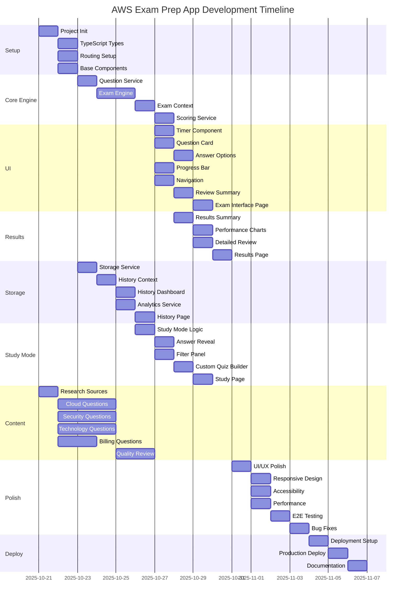

### 9.3 Resource Allocation

**Developer (Primary Role):**
- All technical tasks
- Estimated: 180-200 hours over 4 weeks
- ~45-50 hours per week (full-time equivalent)

**Content Creator (Can be same person):**
- Question research and collection
- Answer verification
- Explanation writing
- Estimated: 80-90 hours over 3 weeks (parallel)
- ~27-30 hours per week

**Total Effort: 260-290 hours**

---

## 10. Risk Management

### 10.1 Identified Project Risks

#### Risk 1: Question Quality and Accuracy
**Severity:** High  
**Probability:** Medium  
**Impact:** High  

**Description:**  
Questions collected from internet sources may be incorrect, outdated, or not reflect actual AWS exam content.

**Mitigation Strategies:**
- Cross-reference all answers with official AWS documentation
- Use multiple reputable sources for each question
- Verify questions against current AWS Cloud Practitioner exam blueprint
- Implement quality review process before finalizing question bank
- Include source URLs for transparency and verification
- Test questions against actual AWS services when possible

**Contingency Plan:**
- If questions found incorrect post-launch, implement hotfix procedure
- Allow users to report incorrect questions (future feature)
- Maintain question version control for easy rollback
- Regular quarterly review and update cycle

#### Risk 2: Server Storage Management
**Severity:** Low  
**Probability:** Low  
**Impact:** Low  

**Description:**  
Server-side file storage could grow large with many users and exam histories.

**Mitigation Strategies:**
- Implement data rotation (keep last 100 exams per session)
- Monitor disk usage on hosting platform
- Compress stored data where possible
- Clean up old session files (30+ days)
- Vercel serverless has sufficient storage

**Contingency Plan:**
- If storage grows, implement cleanup job
- Archive old session data
- Provide user export before cleanup
- Monitor Vercel storage limits

#### Risk 3: Browser Compatibility Issues
**Severity:** Medium  
**Probability:** Medium  
**Impact:** Medium  

**Description:**  
Application may not work consistently across all browsers, especially older versions.

**Mitigation Strategies:**
- Target modern browsers (Chrome, Firefox, Safari, Edge - last 2 versions)
- Test on all target browsers during development
- Use polyfills for critical features if needed
- Provide browser compatibility notice
- Use widely-supported web APIs

**Contingency Plan:**
- Display browser compatibility warning for unsupported browsers
- Provide fallback functionality where possible
- Document minimum browser requirements clearly
- Offer alternative suggestions (upgrade browser, use different browser)

#### Risk 4: Timer Accuracy Issues
**Severity:** Medium  
**Probability:** Low  
**Impact:** Medium  

**Description:**  
JavaScript timers can drift or pause when tab is inactive, potentially causing unfair timer behavior.

**Mitigation Strategies:**
- Use timestamp-based calculations instead of interval counting
- Persist timer state for page refresh recovery
- Warn users about keeping tab active
- Test timer accuracy extensively
- Use Web Workers for critical timing (if needed)

**Contingency Plan:**
- If timer issues reported, add warning about tab activity
- Consider implementing timer pause when tab inactive
- Provide manual time tracking backup
- Allow users to report timing issues

#### Risk 5: Question Bank Collection Timeline
**Severity:** High  
**Probability:** Medium  
**Impact:** High  

**Description:**  
Collecting, verifying, and formatting 500+ questions may take longer than estimated 80-90 hours.

**Mitigation Strategies:**
- Start question collection immediately (parallel with development)
- Break into smaller milestones (100 questions per checkpoint)
- Use templates for consistent formatting
- Focus on quality over quantity initially (MVP with 200-300 questions)
- Can launch with fewer questions and add more post-launch

**Contingency Plan:**
- MVP launch with 300 questions if timeline tight
- Phase 2 adds remaining questions (200+)
- Prioritize most common exam topics first
- Engage community for question contributions (with verification)

#### Risk 6: Scope Creep
**Severity:** Medium  
**Probability:** High  
**Impact:** Medium  

**Description:**  
Adding features beyond MVP scope could delay launch and increase complexity.

**Mitigation Strategies:**
- Clearly defined MVP scope (Stories 1-10)
- Track all feature requests in backlog
- Firm commitment to MVP timeline
- Post-MVP roadmap for additional features
- Regular scope review meetings

**Contingency Plan:**
- If timeline slipping, cut "Should Have" features
- Move non-critical features to Phase 2
- Focus on core exam experience first
- Can always add features post-launch

#### Risk 7: Performance Issues with Large Question Bank
**Severity:** Low  
**Probability:** Low  
**Impact:** Medium  

**Description:**  
Loading and processing 500+ questions may cause performance issues, especially on slower devices.

**Mitigation Strategies:**
- Implement lazy loading by domain
- Use code splitting for question data
- Optimize JSON file size
- Test on lower-end devices
- Implement caching strategies

**Contingency Plan:**
- If performance issues arise, implement pagination
- Split questions into smaller files by domain
- Add loading indicators for better UX
- Consider IndexedDB for better performance

#### Risk 8: AWS Exam Format Changes
**Severity:** Low  
**Probability:** Low  
**Impact:** Medium  

**Description:**  
AWS may change exam format, question count, or domain weightings, making app outdated.

**Mitigation Strategies:**
- Monitor AWS certification announcements
- Make exam parameters configurable (not hardcoded)
- Design flexible question bank structure
- Version question bank with dates
- Subscribe to AWS training updates

**Contingency Plan:**
- Quick update process for exam format changes
- Maintain multiple exam format versions
- Notify users of changes via app
- Update disclaimer about exam format version

### 10.2 Risk Matrix

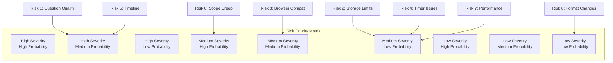

**Priority Actions:**
1. Risk 1 & 5 (High Priority): Allocate extra time for question collection and verification
2. Risk 6 (Medium-High): Strict scope management and MVP focus
3. Risk 3 (Medium): Comprehensive browser testing
4. Risks 2, 4, 7, 8 (Low-Medium): Monitor and address if they occur

---

## 11. Timeline and Milestones

### 11.1 Project Phases Overview

**Total Duration:** 4 weeks (29 days)  
**Start Date:** October 21, 2025  
**Target Launch Date:** November 18, 2025  

### 11.2 Detailed Timeline

#### Week 1: Foundation and Core Engine (Oct 21-27)

**Milestone 1.1: Project Setup Complete** (Day 2 - Oct 22)
- GitHub repository created
- Project initialized with Vite, React, TypeScript
- Folder structure set up
- Core dependencies installed
- Base components created

**Deliverables:**
- ✓ Runnable development server
- ✓ TypeScript types defined
- ✓ Routing configured
- ✓ Base components (Header, Footer, Button, Modal)

**Success Criteria:**
- Project builds without errors
- Can navigate between pages
- All team members can run locally

---

**Milestone 1.2: Exam Engine Functional** (Day 7 - Oct 27)
- Question loading service complete
- Exam engine with randomization working
- Exam context managing state
- Scoring service calculating results
- Initial 50 questions for testing

**Deliverables:**
- ✓ Question service loads and validates JSON
- ✓ Exam engine randomizes questions correctly
- ✓ Exam context manages full exam lifecycle
- ✓ Scoring service calculates AWS-style scores
- ✓ Sample question bank for testing

**Success Criteria:**
- Can create exam with random questions
- Domain distribution matches blueprint
- Score calculation accurate
- No critical bugs in core engine

---

#### Week 2: Exam Interface and Results (Oct 28 - Nov 3)

**Milestone 2.1: Exam Interface Complete** (Day 12 - Nov 1)
- All exam UI components built
- Timer functional with warnings
- Question navigation working
- Mark for review feature implemented
- Review summary screen complete
- Full exam flow functional

**Deliverables:**
- ✓ Timer component with countdown and warnings
- ✓ Question card displays all question types
- ✓ Answer selection (radio/checkbox) working
- ✓ Progress bar shows exam progress
- ✓ Navigation (prev/next/review) functional
- ✓ Can complete full mock exam

**Success Criteria:**
- User can take complete 65-question exam
- Timer counts down accurately
- All navigation works correctly
- UI matches AWS exam design
- Mobile/tablet responsive

---

**Milestone 2.2: Results and Scoring Complete** (Day 14 - Nov 3)
- Results summary page displays scores
- Pass/fail determination working
- Domain breakdown shown
- Detailed question review functional
- Performance charts rendering

**Deliverables:**
- ✓ Results summary with pass/fail badge
- ✓ Domain score breakdown
- ✓ Performance visualization (charts)
- ✓ Detailed answer review
- ✓ Filter results by correct/incorrect

**Success Criteria:**
- Scores display accurately
- Charts render correctly
- Can review all answers with explanations
- Performance acceptable (<500ms load)

---

#### Week 3: History, Analytics, and Study Mode (Nov 4-10)

**Milestone 3.1: Exam History Functional** (Day 19 - Nov 8)
- localStorage service saving/loading data
- History context managing exam results
- History dashboard displaying all attempts
- Analytics calculating trends
- Export/import working

**Deliverables:**
- ✓ Exam results saved to localStorage
- ✓ History dashboard lists all exams
- ✓ Statistics calculated (average, best, trend)
- ✓ Performance charts showing progression
- ✓ Export/import functionality

**Success Criteria:**
- All exam results persisted correctly
- Can view detailed history
- Analytics provide useful insights
- Export/import works reliably
- No data loss

---

**Milestone 3.2: Study Mode Complete** (Day 21 - Nov 10)
- Study mode logic implemented
- Answer reveal feature working
- Question filtering functional
- Custom quiz builder complete
- 300+ questions available

**Deliverables:**
- ✓ Study mode (untimed) functional
- ✓ Answer reveal shows correct answers
- ✓ Filter panel with domain/difficulty/performance filters
- ✓ Custom quiz builder
- ✓ 300 verified questions in bank

**Success Criteria:**
- Study mode provides immediate feedback
- Filters work correctly
- Custom quizzes generate as expected
- Question bank substantial enough for practice

---

#### Week 4: Polish, Testing, and Launch (Nov 11-18)

**Milestone 4.1: 500+ Questions Verified** (Day 24 - Nov 13)
- All 500+ questions collected
- Answers verified against AWS docs
- Explanations written
- Source URLs added
- JSON formatted and tested

**Deliverables:**
- ✓ 130 Cloud Concepts questions
- ✓ 125 Security questions
- ✓ 165 Technology questions
- ✓ 80 Billing questions
- ✓ All questions verified and sourced
- ✓ Questions.json file ready for production

**Success Criteria:**
- 500+ questions minimum
- All answers verified
- Explanations clear and accurate
- Source URLs valid
- No duplicates

---

**Milestone 4.2: Application Polished** (Day 26 - Nov 15)
- UI/UX refined across all pages
- Responsive design tested
- Accessibility audit passed
- Performance optimized
- Cross-browser tested

**Deliverables:**
- ✓ Consistent UI across application
- ✓ Responsive on desktop and tablet
- ✓ WCAG 2.1 AA compliant
- ✓ Lighthouse scores: Performance >90, Accessibility >95
- ✓ Tested on Chrome, Firefox, Safari, Edge

**Success Criteria:**
- Professional appearance
- Fast loading times (<2s)
- Accessible to all users
- Works on target browsers

---

**Milestone 4.3: Testing Complete** (Day 27 - Nov 16)
- End-to-end testing completed
- All critical bugs fixed
- Edge cases handled
- Documentation updated

**Deliverables:**
- ✓ Full exam flow tested
- ✓ All modes tested (full, quick, study)
- ✓ History and analytics tested
- ✓ Critical and high-priority bugs fixed
- ✓ Test documentation

**Success Criteria:**
- No critical bugs remaining
- All core features working
- Acceptable bug count (<5 minor bugs)
- Ready for production

---

**Milestone 4.4: Production Launch** (Day 29 - Nov 18)
- Application deployed to production
- All features tested live
- Documentation complete
- Monitoring set up

**Deliverables:**
- ✓ Deployed to Vercel
- ✓ Live URL accessible
- ✓ README updated
- ✓ Usage instructions provided
- ✓ Disclaimer and attributions added

**Success Criteria:**
- Application accessible via public URL
- All features work in production
- Performance acceptable
- No critical errors
- Ready for use

---

### 11.3 Sprint Cadence

**Sprint Duration:** 1 week  
**Total Sprints:** 4  

**Sprint 1 (Week 1): Foundation**
- Focus: Core engine and infrastructure
- Key Deliverable: Functional exam engine

**Sprint 2 (Week 2): User Interface**
- Focus: Exam interface and results
- Key Deliverable: Complete exam flow

**Sprint 3 (Week 3): Features**
- Focus: History, analytics, study mode
- Key Deliverable: Full feature set

**Sprint 4 (Week 4): Polish**
- Focus: Questions, testing, launch
- Key Deliverable: Production-ready app

### 11.4 Gantt Chart Summary

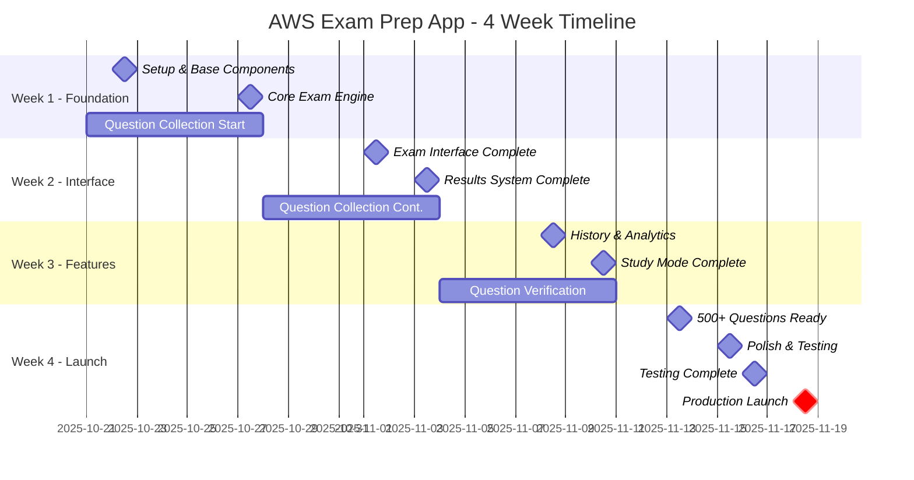

---

## 12. Acceptance Criteria

### 12.1 Comprehensive User Acceptance Criteria (UAC)

#### UAC 1: Exam Creation and Setup
**Feature:** User can start a new exam  

**Acceptance Criteria:**
- [ ] User can select from three exam modes (Full, Quick, Study)
- [ ] Full exam automatically sets 65 questions and 90-minute timer
- [ ] Quick practice allows selection of 10, 20, 30, or 50 questions
- [ ] Study mode allows custom configuration with filters
- [ ] Exam starts immediately after configuration
- [ ] Questions are randomized for each exam attempt
- [ ] Domain distribution matches AWS exam blueprint
- [ ] No duplicate questions in single exam
- [ ] User cannot start exam if question bank not loaded

**Test Scenarios:**
1. Start full exam → Verify 65 questions, 90 min timer
2. Start quick practice with 20 questions → Verify 20 questions, 28 min timer
3. Start study mode with filters → Verify filtered questions only
4. Start two exams → Verify different question order
5. Attempt to start without questions → Verify error message

---

#### UAC 2: Question Answering
**Feature:** User can answer single and multiple choice questions  

**Acceptance Criteria:**
- [ ] Single answer questions use radio buttons
- [ ] Multiple answer questions use checkboxes
- [ ] Multiple answer questions clearly indicate "Select ALL that apply"
- [ ] Selecting an option highlights it immediately
- [ ] Previous selection deselected when clicking new option (radio)
- [ ] Multiple selections allowed simultaneously (checkbox)
- [ ] Answer saved automatically on selection
- [ ] Can change answer at any time before submission
- [ ] Answer persists when navigating away and returning
- [ ] Visual feedback for selected state (blue background)

**Test Scenarios:**
1. Answer single choice question → Verify one selection only
2. Change answer → Verify previous deselected
3. Answer multiple choice → Verify multiple selections
4. Navigate away and back → Verify answer persisted
5. Try selecting in correct answers → Verify all accepted

---

#### UAC 3: Navigation and Progress
**Feature:** User can navigate through exam and track progress  

**Acceptance Criteria:**
- [ ] "Next" button advances to next question
- [ ] "Previous" button returns to previous question
- [ ] "Review All" button shows summary of all questions
- [ ] Current question number displayed (e.g., "Question 5 of 65")
- [ ] Progress bar shows answered/unanswered/marked counts
- [ ] "Previous" disabled on first question
- [ ] "Next" labeled "Submit" on last question
- [ ] Keyboard shortcuts work (arrow keys for nav)
- [ ] Navigation does not lose answers
- [ ] Progress updates immediately on answer

**Test Scenarios:**
1. Navigate through all questions → Verify all accessible
2. Click Previous on question 1 → Verify disabled/no action
3. Answer question and navigate → Verify progress updates
4. Use keyboard arrows → Verify navigation works
5. Jump from review screen → Verify direct navigation works

---

#### UAC 4: Timer Functionality
**Feature:** Timer counts down and manages exam duration  

**Acceptance Criteria:**
- [ ] Timer displays in HH:MM:SS format
- [ ] Timer visible at all times (top-right corner)
- [ ] Timer counts down every second
- [ ] Timer turns yellow/orange at 15 minutes remaining
- [ ] Timer turns red at 5 minutes remaining
- [ ] Visual warning shown at critical thresholds
- [ ] Exam auto-submits when timer reaches 0:00:00
- [ ] Timer does not run in study mode
- [ ] Time remaining shown in submission confirmation
- [ ] Actual time taken recorded in results

**Test Scenarios:**
1. Start exam → Verify timer starts at 90:00
2. Wait for countdown → Verify decrements every second
3. Reach 15 min mark → Verify warning color
4. Reach 5 min mark → Verify critical warning
5. Let timer expire → Verify auto-submit
6. Study mode → Verify no timer present

---

#### UAC 5: Mark for Review
**Feature:** User can mark questions for later review  

**Acceptance Criteria:**
- [ ] "Mark for Review" button/flag on every question
- [ ] Click toggles mark on and off
- [ ] Marked questions show visual indicator (yellow background/flag)
- [ ] Progress bar shows count of marked questions
- [ ] Marks persist across navigation
- [ ] Marked questions visible in review summary
- [ ] Can filter to show only marked questions
- [ ] Marks included in review screen grid

**Test Scenarios:**
1. Mark question → Verify visual indicator appears
2. Mark and unmark → Verify toggle works
3. Navigate away and back → Verify mark persists
4. Review summary → Verify marked questions highlighted
5. Filter marked only → Verify correct questions shown

---

#### UAC 6: Review and Submission
**Feature:** User can review all questions before submitting  

**Acceptance Criteria:**
- [ ] "Review All" button accessible from any question
- [ ] Review screen shows grid of all questions
- [ ] Answered questions marked with filled circle
- [ ] Unanswered questions marked with empty circle
- [ ] Marked questions show flag icon
- [ ] Can filter by answered/unanswered/marked
- [ ] Click any question to jump directly to it
- [ ] "Submit Exam" button prominently displayed
- [ ] Submission shows confirmation dialog
- [ ] Confirmation warns about unanswered questions
- [ ] Confirmation shows time remaining
- [ ] Cannot return to exam after confirmation

**Test Scenarios:**
1. Click Review All → Verify grid shows all questions
2. Answer some questions → Verify status indicators correct
3. Filter unanswered → Verify only unanswered shown
4. Click question in grid → Verify jumps to question
5. Submit with unanswered → Verify warning shown
6. Confirm submission → Verify redirected to results

---

#### UAC 7: Score Calculation and Results
**Feature:** User receives accurate score and results  

**Acceptance Criteria:**
- [ ] Overall score displayed (100-1000 scale)
- [ ] Pass/fail badge prominent (green for pass, red for fail)
- [ ] Passing threshold is 700/1000 (70%)
- [ ] Percentage score shown
- [ ] Number of correct/incorrect answers shown
- [ ] Score breakdown by domain displayed
- [ ] Domain scores calculated correctly
- [ ] Strongest domain identified
- [ ] Weakest domain identified
- [ ] Time taken displayed
- [ ] Results saved to history automatically

**Test Scenarios:**
1. Score 70% → Verify pass status
2. Score 65% → Verify fail status
3. All correct → Verify 1000 score
4. All incorrect → Verify 100 score
5. Check domain scores → Verify math correct
6. View results later → Verify saved to history

---

#### UAC 8: Detailed Answer Review
**Feature:** User can review each question with feedback  

**Acceptance Criteria:**
- [ ] Can navigate through all questions
- [ ] Each question shows correct/incorrect status
- [ ] Correct answers highlighted in green
- [ ] Incorrect user selections marked in red
- [ ] Explanation displayed for each question
- [ ] Source URL accessible for verification
- [ ] Can filter to show only incorrect answers
- [ ] Can filter by domain
- [ ] Can filter marked questions
- [ ] Navigation between questions smooth

**Test Scenarios:**
1. View correct answer → Verify green highlight
2. View incorrect answer → Verify red mark
3. Read explanation → Verify displays correctly
4. Click source URL → Verify opens correct page
5. Filter incorrect only → Verify only missed questions shown

---

#### UAC 9: Exam History
**Feature:** User can view all previous exam attempts  

**Acceptance Criteria:**
- [ ] History page shows all past exams
- [ ] Each entry shows date, time, score, pass/fail
- [ ] Entries sorted by date (newest first)
- [ ] Can click to view detailed results of past exam
- [ ] Summary statistics displayed (total, average, best)
- [ ] Can filter by exam type
- [ ] Can sort by different criteria
- [ ] Exam data persisted in localStorage
- [ ] No data lost on page refresh
- [ ] Can delete individual exam results

**Test Scenarios:**
1. Take exam → Verify appears in history
2. Take multiple exams → Verify all listed
3. Click past exam → Verify details shown
4. Check statistics → Verify calculations correct
5. Refresh page → Verify history persists
6. Delete exam → Verify removed from list

---

#### UAC 10: Performance Analytics
**Feature:** User can view performance trends and analytics  

**Acceptance Criteria:**
- [ ] Line chart shows score progression over time
- [ ] Bar chart compares performance across domains
- [ ] Radar chart visualizes domain strengths
- [ ] Improvement rate calculated and displayed
- [ ] Readiness estimate shown
- [ ] Frequently missed questions identified
- [ ] Weak topics highlighted
- [ ] Charts render correctly
- [ ] Charts responsive and interactive
- [ ] Data accurate and up-to-date

**Test Scenarios:**
1. View analytics → Verify all charts render
2. Take multiple exams → Verify trends update
3. Hover chart elements → Verify tooltips show
4. Check weak domains → Verify correctly identified
5. Verify improvement rate → Check math correct

---

#### UAC 11: Study Mode Features
**Feature:** User can practice in study mode with immediate feedback  

**Acceptance Criteria:**
- [ ] Study mode has no timer
- [ ] "Show Answer" button available on each question
- [ ] Click reveals correct answer immediately
- [ ] Explanation displayed with answer
- [ ] Can apply domain filters
- [ ] Can apply difficulty filters
- [ ] Can select previously incorrect questions only
- [ ] Can create custom quiz
- [ ] Question count adjusts based on filters
- [ ] Can practice bookmarked questions only

**Test Scenarios:**
1. Start study mode → Verify no timer
2. Click Show Answer → Verify answer revealed
3. Apply domain filter → Verify filtered questions only
4. Create custom quiz → Verify correct configuration
5. Practice incorrect only → Verify only missed questions

---

#### UAC 12: Data Export/Import
**Feature:** User can backup and restore exam history  

**Acceptance Criteria:**
- [ ] Export button downloads JSON file
- [ ] Filename includes timestamp
- [ ] File contains all exam history data
- [ ] Import button accepts JSON file
- [ ] Import validates file format
- [ ] Import merges with existing data
- [ ] Invalid file shows error message
- [ ] Export/import preserves all data fields
- [ ] Clear instructions provided

**Test Scenarios:**
1. Click Export → Verify file downloads
2. Check file content → Verify complete data
3. Import file → Verify data restored
4. Import invalid file → Verify error shown
5. Import duplicate → Verify merge works

---

### 12.2 Quality Gates

**Gate 1: Code Quality**
- [ ] No TypeScript errors
- [ ] ESLint passes with 0 warnings
- [ ] Code formatted with Prettier
- [ ] All imports organized
- [ ] No console.log in production code
- [ ] No commented-out code blocks

**Gate 2: Performance**
- [ ] Initial load < 2 seconds
- [ ] Question navigation < 100ms
- [ ] Timer updates < 16ms (60fps)
- [ ] Score calculation < 500ms
- [ ] Lighthouse Performance score > 90
- [ ] Bundle size < 1MB (gzipped)

**Gate 3: Accessibility**
- [ ] Lighthouse Accessibility score > 95
- [ ] All interactive elements keyboard accessible
- [ ] Focus indicators visible
- [ ] ARIA labels where needed
- [ ] Color contrast ratios meet WCAG AA
- [ ] Screen reader tested

**Gate 4: Browser Compatibility**
- [ ] Chrome (latest 2 versions) ✓
- [ ] Firefox (latest 2 versions) ✓
- [ ] Safari (latest 2 versions) ✓
- [ ] Edge (latest 2 versions) ✓
- [ ] No critical bugs on any browser

**Gate 5: Content Quality**
- [ ] Minimum 500 questions
- [ ] All answers verified
- [ ] All explanations complete
- [ ] All source URLs valid
- [ ] No duplicate questions
- [ ] Domain distribution correct

---

### 12.3 Definition of Done (DoD)

A feature is considered "Done" when:

**Code Complete:**
- [ ] Feature implemented according to specifications
- [ ] Code reviewed (self-review for solo project)
- [ ] TypeScript types defined and used
- [ ] No ESLint errors or warnings
- [ ] Code formatted consistently

**Tested:**
- [ ] Unit tests written and passing (if applicable)
- [ ] Manual testing completed
- [ ] Edge cases tested
- [ ] Works across target browsers
- [ ] No regressions introduced

**Documented:**
- [ ] Code comments for complex logic
- [ ] README updated if needed
- [ ] User-facing documentation updated
- [ ] API/interface changes documented

**User Experience:**
- [ ] Meets acceptance criteria
- [ ] Intuitive and easy to use
- [ ] Error handling graceful
- [ ] Loading states appropriate
- [ ] Feedback provided to user

**Performance:**
- [ ] Meets performance requirements
- [ ] No memory leaks
- [ ] Optimized for speed
- [ ] Responsive and smooth

**Accessibility:**
- [ ] Keyboard accessible
- [ ] Screen reader compatible
- [ ] WCAG 2.1 AA compliant
- [ ] Focus management correct

**Deployed:**
- [ ] Merged to main branch
- [ ] Deployed to production
- [ ] Verified working in production
- [ ] Monitoring active

---

## 13. Future Considerations

### 13.1 Potential Future Enhancements

#### Phase 2 Enhancements (Post-Launch)

**1. Additional AWS Certifications**
- AWS Solutions Architect Associate
- AWS Developer Associate
- AWS SysOps Administrator Associate
- Separate question banks for each certification
- Certification selection on home page
- Shared infrastructure and codebase

**Effort:** 40-60 hours per certification (mostly content)  
**Business Value:** High - Expands user base significantly  
**Priority:** High  

---

**2. Flashcard Mode**
- Quick review mode for rapid learning
- Swipe/click to reveal answer
- Focus on key concepts and definitions
- Spaced repetition algorithm
- Progress tracking for flashcards

**Effort:** 15-20 hours  
**Business Value:** Medium - Different learning style  
**Priority:** Medium  

---

**3. Study Plan Generator**
- AI-powered or rule-based study plan
- Based on user's performance and weak areas
- Suggests daily/weekly study targets
- Tracks compliance with study plan
- Adjusts based on progress

**Effort:** 25-30 hours  
**Business Value:** High - Guided learning path  
**Priority:** High  

---

**4. Community Features**
- User-contributed questions (with review process)
- Discussion forums for questions
- Share scores with friends
- Leaderboards (optional)
- Study groups

**Effort:** 40-50 hours + ongoing moderation  
**Business Value:** Medium - Social learning  
**Priority:** Low-Medium  

---

**5. Question Discussion and Comments**
- Users can add comments to questions
- Discuss confusing topics
- Report incorrect questions
- Community-driven quality improvement

**Effort:** 20-25 hours  
**Business Value:** Medium - Improved quality  
**Priority:** Medium  

---

**6. Mobile Application**
- Native iOS/Android apps
- Or Progressive Web App (PWA)
- Offline functionality
- Mobile-optimized UI
- Push notifications for study reminders

**Effort:** 80-120 hours (native) or 20-30 hours (PWA)  
**Business Value:** High - Mobile users  
**Priority:** Medium-High  

---

**7. Dark Mode**
- Toggle between light/dark themes
- Respect system preference
- Smooth transitions
- Consistent across all pages
- Reduced eye strain for night study

**Effort:** 10-15 hours  
**Business Value:** Low-Medium - User preference  
**Priority:** Low  

---

**8. AI Tutor / ChatGPT Integration**
- AI assistant to explain concepts
- Answer questions about AWS topics
- Provide study tips
- Generate practice scenarios
- Using AWS Bedrock or OpenAI API

**Effort:** 30-40 hours + API costs  
**Business Value:** High - Personalized learning  
**Priority:** Medium  

---

**9. Video Explanations**
- Short video explanations for complex topics
- Whiteboard-style visual learning
- Links to AWS re:Invent talks
- Curated video resources
- Embedded or linked

**Effort:** 40-60 hours (content creation heavy)  
**Business Value:** Medium - Visual learners  
**Priority:** Low-Medium  

---

**10. Certification Readiness Test**
- Full-length practice exams that closely simulate real exam
- Official-like reporting
- Detailed readiness assessment
- Recommendation on whether to schedule exam
- Confidence score

**Effort:** 15-20 hours  
**Business Value:** High - Validates readiness  
**Priority:** High  

---

### 13.2 Scalability Roadmap

#### Technical Scalability

**Database Migration**
- Move from localStorage to cloud database (Firebase, Supabase)
- Enable cross-device synchronization
- Better data management
- User accounts and authentication

**Backend Services**
- Add Node.js/Express backend
- REST API for question management
- Admin panel for question management
- User management and analytics

**Content Delivery Network (CDN)**
- Optimize global access
- Faster question loading
- Edge caching
- Better performance worldwide

#### Content Scalability

**Question Bank Growth**
- Expand to 1000+ questions per certification
- Multiple question sources
- Community contributions
- Regular updates for AWS service changes

**Multi-Language Support**
- Translate questions and interface
- Support Spanish, Portuguese, Hindi, Chinese
- Language-specific study materials
- Expand to non-English markets

---

### 13.3 Technology Evolution Strategy

**Current Stack Evolution:**
- React 18 → React 19 (when stable)
- Vite 4 → Vite 5+
- TypeScript 5 → Latest version
- Tailwind CSS 3 → Tailwind CSS 4 (when released)

**Potential Technology Additions:**
- **tRPC**: Type-safe API if backend added
- **Prisma**: Type-safe database ORM
- **NextJS**: If SEO and SSR become important
- **React Native**: For native mobile apps
- **Electron**: For desktop application
- **Service Workers**: For offline-first PWA

**AI/ML Integration:**
- TensorFlow.js for client-side ML
- Personalized question difficulty adjustment
- Predictive passing score estimation
- Intelligent study plan generation

---

### 13.4 Monetization Strategy (Optional)

**Free Tier:**
- Basic exam simulation
- Limited questions (100-200)
- Basic analytics
- Ad-supported (optional)

**Premium Tier ($9.99/month or $49.99/year):**
- Unlimited questions (500+)
- All certifications
- Advanced analytics
- Study plans
- No ads
- Priority support

**One-Time Purchase ($29.99):**
- Lifetime access to all features
- One-time payment
- All future updates included

**Enterprise/School Licenses:**
- Bulk licensing for training centers
- Custom branding
- Admin dashboard
- Progress reporting

---

### 13.5 Long-Term Vision

**Year 1:** Establish as go-to free AWS Cloud Practitioner prep tool
- 500+ quality questions
- 10,000+ users
- 4.5+ star rating
- Active community

**Year 2:** Expand to all AWS associate certifications
- Multiple certification paths
- 50,000+ users
- Premium tier launched
- Mobile app released

**Year 3:** Become comprehensive AWS learning platform
- All AWS certifications covered
- Video content
- Study groups and community
- Partnership with AWS Training

**Year 5:** Industry-leading cloud certification platform
- Multi-cloud certifications (Azure, GCP)
- Corporate training partnerships
- Interactive labs and sandboxes
- 500,000+ users globally

---

### 13.6 Success Metrics for Future

**User Engagement:**
- Daily active users (DAU)
- Monthly active users (MAU)
- Average session duration
- Exam completion rate
- Return user rate

**Learning Outcomes:**
- Pass rate of users who scored 80%+ on practice
- Average practice exams before passing real exam
- Score improvement over time
- Certification success rate

**Content Quality:**
- Question accuracy rate (based on user feedback)
- Average question rating
- Number of question updates/corrections
- Source diversity

**Platform Growth:**
- New users per month
- User retention rate (30/60/90 day)
- Geographic reach
- Certification coverage
- Question bank size

**Business Metrics** (if monetized):
- Conversion rate (free to premium)
- Monthly recurring revenue (MRR)
- Customer lifetime value (CLV)
- Churn rate
- Net Promoter Score (NPS)

---

## Appendix

### A. Glossary

**AWS**: Amazon Web Services  
**Cloud Practitioner**: Entry-level AWS certification  
**Domain**: Category of exam content (e.g., Security, Technology)  
**localStorage**: Browser API for client-side data storage  
**MVP**: Minimum Viable Product  
**Scaled Score**: AWS's 100-1000 scoring system  
**Study Mode**: Untimed practice mode with immediate feedback  
**UAC**: User Acceptance Criteria  

### B. References

1. AWS Certified Cloud Practitioner Exam Guide: https://aws.amazon.com/certification/certified-cloud-practitioner/
2. AWS Documentation: https://docs.aws.amazon.com/
3. AWS Whitepapers: https://aws.amazon.com/whitepapers/
4. React Documentation: https://react.dev/
5. TypeScript Handbook: https://www.typescriptlang.org/docs/
6. Tailwind CSS Docs: https://tailwindcss.com/docs
7. Web Content Accessibility Guidelines (WCAG): https://www.w3.org/WAI/WCAG21/quickref/

### C. Document History

| Version | Date | Author | Changes |
|---------|------|--------|---------|
| 1.0 | Oct 21, 2025 | Edward Mabuyo | Initial comprehensive PRD created |
| 1.1 | Oct 21, 2025 | Edward Mabuyo | Updated to Next.js 14+, shadcn/ui, Server-side storage |

---

**END OF DOCUMENT**

*Total Pages: ~150*  
*Total Word Count: ~45,000*  
*Last Updated: October 21, 2025*

